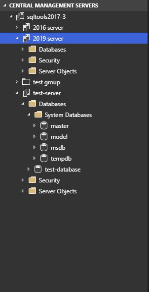

# SQL Server Central Management Servers extension (preview)

The Central Management Servers extension allows users to store a list of instances of SQL Server that is organized into one or more groups. Actions that are taken using a CMS group act on all servers in the server group.

This experience is currently in its initial preview. Report issues and feature requests [here](https://github.com/microsoft/azuredatastudio/issues).

## Install the SQL Server Central Management Servers extension

1. To open the extensions manager and access the available extensions, select the extensions icon, or select **Extensions** in the **View** menu.
2. Select an available extension to view its details.
1. Select the extension you want (SQL Server Central Management Servers) and **Install** it.

### How do I start Central Management Servers?
 Central Management Servers can be viewed by clicking on the Connections icon (Ctrl/Cmd + G). The first time you download the extension, the CMS view will be minimized, and you can open it by click on **Central Management Servers**

## Next steps
To learn more conceptually about Central Management Servers, [you can read more here.](https://docs.microsoft.com/sql/ssms/register-servers/create-a-central-management-server-and-server-group)

