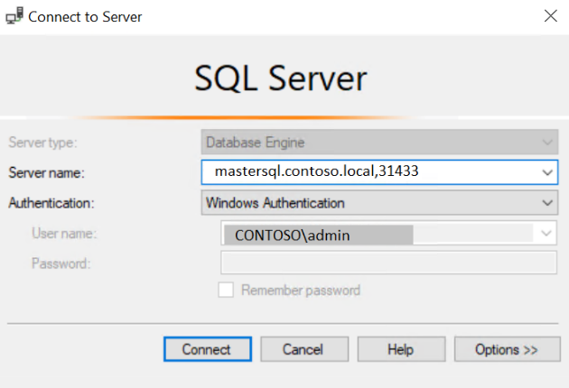

# Connect [!INCLUDE[big-data-clusters-2019](../includes/ssbigdataclusters-ss-nover.md)]: Active Directory mode

This article describes how to connect to SQL Server Big Data Cluster endpoints deployed in Active Directory mode. The tasks in this article require that you have a SQL Server Big Data Cluster deployed in Active Directory mode. If you do not have a cluster, refer to [Deploy [!INCLUDE[big-data-clusters-2019](../includes/ssbigdataclusters-ss-nover.md)] in Active Directory mode](active-directory-deploy.md).

## Overview

Log in to SQL Server master instance with AD Auth.

To verify AD connections to the SQL Server instance, connect to the SQL master instance with `sqlcmd`. Logins are automatically be created for the provided groups upon deployment (`clusterUsers` and `clusterAdmins`).

If you are using Linux, first run `kinit` as the AD user, then run `sqlcmd`. If you are using Windows, simply log in as your desired user from a **domain joined client machine**.

## Connect to master instance from Linux/Mac

```bash
kinit <username>@<domain name>
sqlcmd -S <DNS name for master instance>,31433 -E
```

## Connect to master instance from Windows

```cmd
sqlcmd -S <DNS name for master instance>,31433 -E
```

## Log in to SQL Server master instance using Azure Data Studio or SSMS

From a domain joined client, you can open SSMS or Azure Data Studio and connect to the master instance. This is the same experience as connecting to any SQL Server instance using AD authentication.

From SSMS:



From Azure Data Studio:

}

## Log in to controller with AD authentication

### Connect to controller with AD authentication from Linux/Mac

There are two options for connecting to the controller endpoint using `azdata` and AD authentication. You can use the *--endpoint/-e* parameter:

```bash
kinit <username>@<domain name>
azdata login -e https://<controller DNS name>:30080 --auth ad
```

Alternatively, you can connect using the *--namespace/-n* parameter, which is the big data cluster name:

```bash
kinit <username>@<domain name>
azdata login -n <clusterName> --auth ad
```

### Connect to controller with AD authentication from Windows

```cmd
azdata login -e https://<controller DNS name>:30080 --auth ad
```

## Use AD authentication to Knox gateway (webHDFS)

You can also issue HDFS commands using curl through the Knox gateway endpoint. That requires AD authentication to Knox. The below curl command issues a webHDFS REST call through the Knox gateway to create a directory called `products`

```bash
curl -k -v --negotiate -u : https://<Gateway DNS name>:30443/gateway/default/webhdfs/v1/products?op=MKDIRS -X PUT
```

## Next steps

[Troubleshoot SQL Server Big Data Cluster Active Directory integration](troubleshoot-active-directory.md)

[Concept: deploy [!INCLUDE[big-data-clusters-2019](../includes/ssbigdataclusters-ss-nover.md)] in Active Directory mode](active-directory-deployment-background.md)
