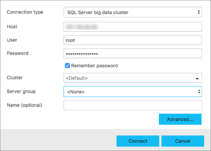

# Connect to a SQL Server big data cluster with Azure Data Studio

This article describes how to connect to a SQL Server 2019 big data cluster (preview) from Azure Data Studio.

## Prerequisites

- A deployed [SQL Server 2019 big data cluster](deployment-guidance.md).
- [SQL Server 2019 big data tools](deploy-big-data-tools.md):
   - **Azure Data Studio**
   - **SQL Server 2019 extension**
   - **kubectl**

## Connect to the cluster

When you connect to a big data cluster, you have the option to connect to the SQL Server [master instance](concept-master-instance.md) or to the HDFS/Spark gateway. The following sections show how to connect to each.

## <a id="master"></a> Master instance

The SQL Server master instance is a traditional SQL Server instance containing relational SQL Server databases. The following steps describe how to connect to the master instance using Azure Data Studio.

1. From the command-line, find the IP of your master instance with the following command:

   ```
   kubectl get svc endpoint-master-pool -n <your-cluster-name>
   ```

1. In Azure Data Studio, press **F1** > **New Connection**.

1. In **Connection type**, select **Microsoft SQL Server**.

1. Type the IP address of the SQL Server master instance in **Server name** (for example: **\<IP Address\>,31433**).

1. Enter a SQL login **User name** and **Password**.

   > [!TIP]
   > By default, the user name is **SA** and, unless changed, the password corresponds to the **MSSQL_SA_PASSWORD** environment variable used during deployment.

1. Change the target **Database name** to one of your relational databases.

   

1. Press **Connect**, and the **Server Dashboard** should appear.

## <a id="hdfs"></a> HDFS/Spark gateway

The **HDFS/Spark gateway** enables you to connect in order to work with the HDFS storage pool and to run Spark jobs. The following steps describe how to connect with Azure Data Studio.

1. From the command-line, find the IP address of your HDFS/Spark gateway with one of the following commands.
   
   **AKS deployments:**

   ```
   kubectl get svc service-security-lb -n <your-cluster-name>
   ```

   **Non-AKS deployments**:

   ```
   kubectl get svc service-security-nodeport -n <your-cluster-name>
   ```
 
1. In Azure Data Studio, press **F1** > **New Connection**.

1. In **Connection type**, select **SQL Server big data cluster**.

1. Type the IP address of the big data cluster in **Server name** (do not specify a port).

1. Enter `root` for the **User** and specify the **Password** to your big data cluster.

   

   > [!TIP]
   > By default, the user name is **root** and the password corresponds to the **KNOX_PASSWORD** environment variable used during deployment.

1. Press **Connect**, and the **Server Dashboard** should appear.

## Next steps

For more information about SQL Server 2019 big data clusters, see [What are SQL Server 2019 big data clusters](big-data-cluster-overview.md).