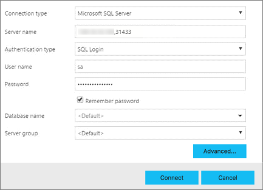
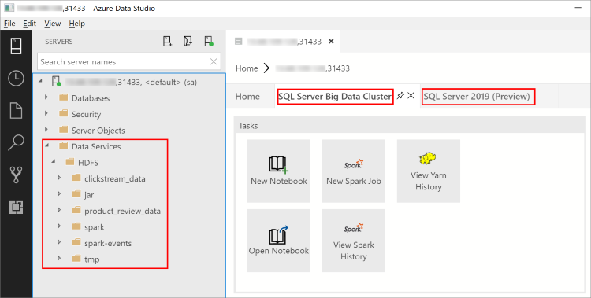

# Connect to a SQL Server big data cluster with Azure Data Studio

[!INCLUDE[tsql-appliesto-ssver15-xxxx-xxxx-xxx](../includes/tsql-appliesto-ssver15-xxxx-xxxx-xxx.md)]

This article describes how to connect to a SQL Server 2019 big data cluster (preview) from Azure Data Studio.

## Prerequisites

- A deployed [SQL Server 2019 big data cluster](deployment-guidance.md).
- [SQL Server 2019 big data tools](deploy-big-data-tools.md):
   - **Azure Data Studio**
   - **SQL Server 2019 extension**
   - **kubectl**

## <a id="master"></a> Connect to the cluster

To connect to a big data cluster with Azure Data Studio, make a new connection to the SQL Server master instance in the cluster. The following steps describe how to connect to the master instance using Azure Data Studio.

1. From the command line, find the IP of your master instance with the following command:

   ```
   kubectl get svc master-svc-external -n <your-big-data-cluster-name>
   ```

   > [!TIP]
   > The big data cluster name defaults to **mssql-cluster** unless you customized the name in a deployment configuration file. For more information, see [Configure deployment settings for big data clusters](deployment-custom-configuration.md#clustername).

1. In Azure Data Studio, press **F1** > **New Connection**.

1. In **Connection type**, select **Microsoft SQL Server**.

1. Type the IP address of the SQL Server master instance in **Server name** (for example: **\<IP Address\>,31433**).

1. Enter a SQL login **User name** and **Password**.

   > [!TIP]
   > By default, the user name is **SA** and, unless changed, the password corresponds to the **MSSQL_SA_PASSWORD** environment variable used during deployment.

1. Change the target **Database name** to one of your relational databases.

   

1. Press **Connect**, and the **Server Dashboard** should appear.

With the February 2019 release of Azure Data Studio, connecting to the SQL Server master instance also enables you to interact with the HDFS/Spark gateway. This means that you do not need to use a separate connection for HDFS and Spark that the next section describes.

- The Object Explorer now contains a new **Data Services** node with right-click support for big data cluster tasks, such as creating new notebooks or submitting spark jobs. 
- The **Data Services** node also contains an **HDFS** folder for HDFS exploration and performing actions such as Create External Table or Analyze in Notebook.
- The **Server Dashboard** for the connection also contains tabs for **SQL Server big data cluster** and **SQL Server 2019 (Preview)** when the extension is installed.

   

## Next steps

For more information about SQL Server 2019 big data clusters, see [What are SQL Server 2019 big data clusters](big-data-cluster-overview.md).