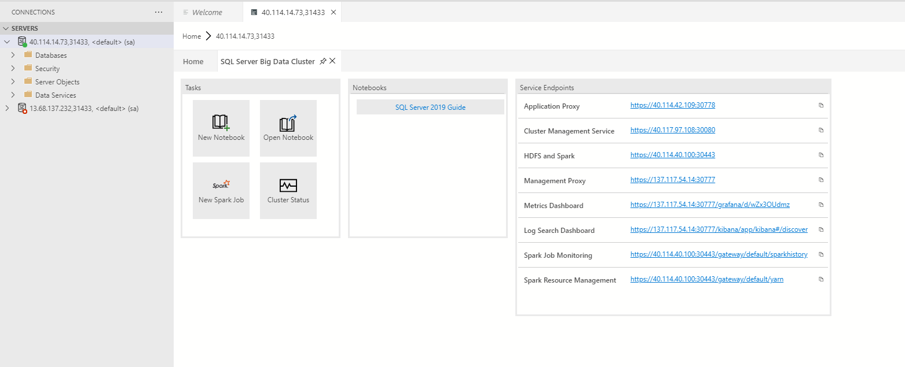

# Manage SQL Server Big Data Clusters with Azure Data Studio notebooks

[!INCLUDE[SQL Server 2019](../includes/applies-to-version/sqlserver2019.md)]

[!INCLUDE[sql-server-2019](../includes/sssqlv15-md.md)] provides an extension for Azure Data Studio that includes notebooks. A notebook provides documentation and code that you can use in Azure Data Studio to manage SQL Server 2019 Big Data Clusters.

Originally implemented as an open-source project, [notebooks](../azure-data-studio/notebooks/notebooks-guidance.md) have been incorporated into [Azure Data Studio](../azure-data-studio/download-azure-data-studio.md?view=sql-server-ver15). You can use markdown for text in the text cells and one of the available kernels to write code in the code cells.

You can use notebooks to deploy big data clusters for [!INCLUDE[sql-server-2019](../includes/sssqlv15-md.md)].

In addition to notebooks, you can view a collection of notebooks, which is called a Jupyter Book. A Jupyter Book provides a table of contents to help you navigate a collection of notebooks so you can easily find the notebook you need, whether you want to troubleshoot SQL Server or view cluster status.

## Prerequisites

You need these prerequisites to open a notebook:

* The latest version of [Azure Data Studio Insiders build](./deploy-big-data-tools.md?viewFallbackFrom=sqlallproducts)
* The [!INCLUDE[sql-server-2019](../includes/sssqlv15-md.md)] extension, installed in Azure Data Studio

In addition to those prerequisites, to deploy SQL Server 2019 Big Data Clusters, you also need:

* [azdata](../azdata/install/deploy-install-azdata.md)
* [kubectl](https://kubernetes.io/docs/tasks/tools/install-kubectl/#install-kubectl-binary-using-native-package-management)
* [Azure CLI](/cli/azure/install-azure-cli)

## Access troubleshooting notebooks

There are three ways to access troubleshooting notebooks.

### Command Palette

1. Select **View** > **Command Palette**.

2. Enter **Jupyter Books: SQL Server 2019 Guide**.

The Jupyter Books viewlet with the Jupyter Book that contains the troubleshooting notebooks related to SQL Server Big Data Clusters will open.

### SQL Master Dashboard

1. After you install Azure Data Studio Insiders, connect to a SQL Server Big Data Clusters instance.

2. After you're connected to the instance, right-click your server name under **CONNECTIONS** and select **Manage**.

3. In the dashboard, select **SQL Server Big Data Cluster**. Select **SQL Server 2019 guide** to open the Jupyter Book that contains the notebooks you need.
    

4. Select the notebook for the task that you need to complete.

### Controller Dashboard

1. In the **Connections** view, expand **SQL Server Big Data Clusters**.

2. Add controller endpoint details.

3. After you're connected to the controller, right-click the endpoint and select **Manage**.

4. After the dashboard loads, select **troubleshoot** to open the Jupyter Book troubleshooting guides.

## Use troubleshooting notebooks

1. Find the troubleshooting guide that you need in the Jupyter Book table of contents.

2. The notebooks are optimized, so you just need to select **Run Cells**. This action will run each cell in the notebook individually until the notebook is complete.

3. If an error is found, the Jupyter Book will suggest a notebook that you can run to fix the error. Follow the recommended steps, and then run the notebook again.

## Change the big data cluster

To change the SQL Server big data cluster for a notebook:

1. Click the **Attach to** menu from the notebook toolbar.

   

2. Click a server from the **Attach to** menu.

   

## Next steps

For more information about notebooks in Azure Data Studio, see [How to use notebooks with SQL Server](../azure-data-studio/notebooks/notebooks-guidance.md).