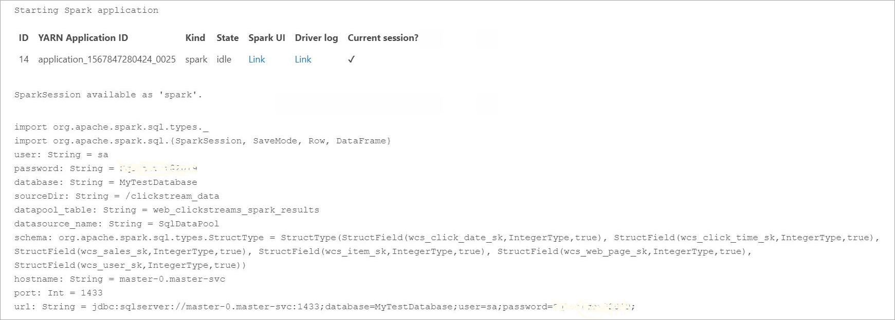

# Tutorial: Ingest data into a SQL Server data pool with Spark jobs

[!INCLUDE[SQL Server 2019](../includes/applies-to-version/sqlserver2019.md)]

This tutorial demonstrates how to use Spark jobs to load data into the [data pool](concept-data-pool.md) of a [!INCLUDE[big-data-clusters-2019](../includes/ssbigdataclusters-ver15.md)]. 

In this tutorial, you learn how to:

> [!div class="checklist"]
> * Create an external table in the data pool.
> * Create a Spark job to load data from HDFS.
> * Query the results in the external table.

> [!TIP]
> If you prefer, you can download and run a script for the commands in this tutorial. For instructions, see the [Data pools samples](https://github.com/Microsoft/sql-server-samples/tree/master/samples/features/sql-big-data-cluster/data-pool) on GitHub.

## <a id="prereqs"></a> Prerequisites

- [Big data tools](deploy-big-data-tools.md)
   - **kubectl**
   - **Azure Data Studio**
   - **SQL Server 2019 extension**
- [Load sample data into your big data cluster](tutorial-load-sample-data.md)

## Create an external table in the data pool

The following steps create an external table in the data pool named **web_clickstreams_spark_results**. This table can then be used as a location for ingesting data into the big data cluster.

1. In Azure Data Studio, connect to the SQL Server master instance of your big data cluster. For more information, see [Connect to the SQL Server master instance](connect-to-big-data-cluster.md#master).

1. Double-click on the connection in the **Servers** window to show the server dashboard for the SQL Server master instance. Select **New Query**.

   

1. Create permissions for MSSQL-Spark Connector.
   ```sql
   USE Sales
   CREATE LOGIN sample_user  WITH PASSWORD ='password123!#' 
   CREATE USER sample_user FROM LOGIN sample_user

   -- To create external tables in data pools
   GRANT ALTER ANY EXTERNAL DATA SOURCE TO sample_user;

   -- To create external table
   GRANT CREATE TABLE TO sample_user;
   GRANT ALTER ANY SCHEMA TO sample_user;

   ALTER ROLE [db_datareader] ADD MEMBER sample_user
   ALTER ROLE [db_datawriter] ADD MEMBER sample_user
   ```

1. Create an external data source to the data pool if it does not already exist.

   ```sql
   USE Sales
   GO
   IF NOT EXISTS(SELECT * FROM sys.external_data_sources WHERE name = 'SqlDataPool')
     CREATE EXTERNAL DATA SOURCE SqlDataPool
     WITH (LOCATION = 'sqldatapool://controller-svc/default');
   ```

1. Create an external table named **web_clickstreams_spark_results** in the data pool.

   ```sql
   USE Sales
   GO
   IF NOT EXISTS(SELECT * FROM sys.external_tables WHERE name = 'web_clickstreams_spark_results')
      CREATE EXTERNAL TABLE [web_clickstreams_spark_results]
      ("wcs_click_date_sk" BIGINT , "wcs_click_time_sk" BIGINT , "wcs_sales_sk" BIGINT , "wcs_item_sk" BIGINT , "wcs_web_page_sk" BIGINT , "wcs_user_sk" BIGINT)
      WITH
      (
         DATA_SOURCE = SqlDataPool,
         DISTRIBUTION = ROUND_ROBIN
      );
   ```
   
1. Create login for data pools and provide permissions to the user.
   ```sql 
   EXECUTE( ' Use Sales; CREATE LOGIN sample_user  WITH PASSWORD = ''password123!#'' ;') AT  DATA_SOURCE SqlDataPool;

   EXECUTE('Use Sales; CREATE USER sample_user; ALTER ROLE [db_datareader] ADD MEMBER sample_user;  ALTER ROLE [db_datawriter] ADD MEMBER sample_user;') AT DATA_SOURCE SqlDataPool;
   ```
   
The creation of data pool external table is a blocking operation. Control returns when the specified table has been created on all back-end data pool nodes. If failure occurred during the create operation, an error message is returned to caller.

## Start a Spark streaming job

The next step is to create a Spark streaming job that loads web clickstream data from the storage pool (HDFS) into the external table you created in the data pool. This data was added to /clickstream_data in [Load sample data into your big data cluster](tutorial-load-sample-data.md).

1. In Azure Data Studio, connect to the master instance of your big data cluster. For more information, see [Connect to a big data cluster](connect-to-big-data-cluster.md).

2. Create a new notebook and select Spark | Scala as your kernel.

3. Run the Spark Ingestion Job
   1. Configure the Spark-SQL connector parameters
      ```
      import org.apache.spark.sql.types._
      import org.apache.spark.sql.{SparkSession, SaveMode, Row, DataFrame}

      // Change per your installation
      val user= "username"
      val password= "****"
      val database =  "MyTestDatabase"
      val sourceDir = "/clickstream_data"
      val datapool_table = "web_clickstreams_spark_results"
      val datasource_name = "SqlDataPool"
      val schema = StructType(Seq(
      StructField("wcs_click_date_sk",LongType,true), StructField("wcs_click_time_sk",LongType,true), 
      StructField("wcs_sales_sk",LongType,true), StructField("wcs_item_sk",LongType,true),
      StructField("wcs_web_page_sk",LongType,true), StructField("wcs_user_sk",LongType,true)
      ))

      val hostname = "master-0.master-svc"
      val port = 1433
      val url = s"jdbc:sqlserver://${hostname}:${port};database=${database};user=${user};password=${password};"
      ```
   2. Define and Run the Spark Job
      * Each job has two parts: readStream and writeStream. Below, we create a data frame using the schema defined above, and then write to the external table in the data pool.
      ```
      import org.apache.spark.sql.{SparkSession, SaveMode, Row, DataFrame}
      
      val df = spark.readStream.format("csv").schema(schema).option("header", true).load(sourceDir)
      val query = df.writeStream.outputMode("append").foreachBatch{ (batchDF: DataFrame, batchId: Long) => 
                batchDF.write
                 .format("com.microsoft.sqlserver.jdbc.spark")
                 .mode("append")
                  .option("url", url)
                  .option("dbtable", datapool_table)
                  .option("user", user)
                  .option("password", password)
                  .option("dataPoolDataSource",datasource_name).save()
               }.start()

      query.awaitTermination(40000)
      query.stop()
      ```
## Query the data

The following steps show that the Spark streaming job loaded the data from HDFS into the data pool.

1. Before querying the ingested data, look at the Spark Execution Status including Yarn App ID, Spark UI and Driver Logs. This information will be displayed in the notebook when you first start the Spark application.

   

1. Return to the SQL Server master instance query window that you opened at the beginning of this tutorial.

1. Run the following query to inspect the ingested data.

   ```sql
   USE Sales
   GO
   SELECT count(*) FROM [web_clickstreams_spark_results];
   SELECT TOP 10 * FROM [web_clickstreams_spark_results];
   ```
1. The data can also be queried in Spark. For example, the code below prints the number of records in the table:
   ```
   def df_read(dbtable: String,
                url: String,
                dataPoolDataSource: String=""): DataFrame = {
        spark.read
             .format("com.microsoft.sqlserver.jdbc.spark")
             .option("url", url)
             .option("dbtable", dbtable)
             .option("user", user)
             .option("password", password)
             .option("dataPoolDataSource", dataPoolDataSource)
             .load()
             }

   val new_df = df_read(datapool_table, url, dataPoolDataSource=datasource_name)
   println("Number of rows is " +  new_df.count)
   ```
## Clean up

Use the following command to remove the database objects created in this tutorial.

```sql
DROP EXTERNAL TABLE [dbo].[web_clickstreams_spark_results];
```

## Next steps

Learn about how to run a sample notebook in Azure Data Studio:
> [!div class="nextstepaction"]
> [Run a sample notebook](notebooks-tutorial-spark.md)
