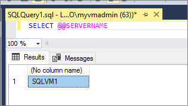
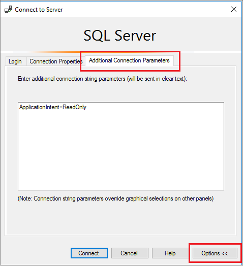
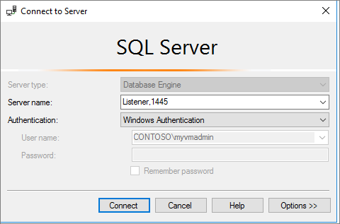

# Connect to an Always On availability group listener 
[!INCLUDE [SQL Server](../../../includes/applies-to-version/sqlserver.md)]
  
Once you've [configured your availability group listener](create-or-configure-an-availability-group-listener-sql-server.md), you'll need to update your connection string to connect to the Always On availability group listener. This will route traffic from your application automatically to the intended replica without having to manually update the connection string after every failover. 
  

##  <a name="ConnectToPrimary"></a> Connect to the primary replica  

Specify the availability group listener DNS name in the connection string to connect to the primary replica for read-write access. 

For example, to connect to the primary replica in SQL Server Management Studio through the listener, enter the listener DNS name in the server name field: 


During a failover, when the primary replica changes, existing connections to the listener are disconnected and new connections are routed to the new primary replica.  

An example of a basic connection string for the ADO.NET provider (System.Data.SqlClient): 
  
```  
Server=tcp: AGListener,1433;Database=MyDB;Integrated Security=SSPI  
```  

You can verify which replica you're currently connected to through the listener by running the following Transact-SQL (T-SQL) command:

```sql
SELECT @@SERVERNAME
```

For example, when SQLVM1 is my primary replica: 




You can still connect directly to the instance of SQL Server using the instance name of the primary or secondary replica instead of using the availability group listener. However, you will then lose the benefit of new connections being routed automatically to the new current primary replica. Additionally, you will lose the benefit of read-only routing, where connections specified with `read-intent` are automatically routed to the readable secondary replica. 

##  <a name="ConnectToSecondary"></a> Connect to a read-only replica 

_Read-only routing_ refers to automatically routing incoming listener connections to a readable secondary replica that is configured to allow read-only workloads. 

Connections are automatically routed to the read-only replica if the following are true: 
 
-   At least one secondary replica is set to read-only access, and each read-only secondary replica and the primary replica are [configured to support read-only routing](configure-read-only-routing-for-an-availability-group-sql-server.md). 

-   The connection string references a database involved in the Availability Group. An alternative to this would be the login used in the connection has the database configured as its default database. For more information, see [this article on how the algorithm works with read-only routing](/archive/blogs/mattn/calculating-read_only_routing_url-for-alwayson).

-   The connection string references an availability group listener, and the application intent of the incoming connection is set to read-only (for example, by using the **Application Intent=ReadOnly** keyword in the ODBC or OLEDB connection strings or connection attributes or properties). 

The application intent attribute is stored in the client's session during login and the instance of SQL Server will then process this intent and determine what to do according to the configuration of the availability group and the current read-write state of the target database in the secondary replica.  

For example, to connect to a read-only replica using SQL Server Management Studio, select **Options** on the **Connect to Server** dialog box, select the **Additional Connection Parameters** tab, and then specify `ApplicationIntent=ReadOnly` in the text box:


  
An example of a connection string for the ADO.NET provider (System.Data.SqlClient) that designates read-only application intent: 

```  
Server=tcp:AGListener;Database=AdventureWorks;Integrated Security=SSPI;ApplicationIntent=ReadOnly  
```  
  
For more information, see [Configure Read-Only Access on an Availability Replica &#40;SQL Server&#41;](../../../database-engine/availability-groups/windows/configure-read-only-access-on-an-availability-replica-sql-server.md)  

## Non-default port

When creating your listener, you designate a port for the listener to use. If the port is the default port of 1433, then you do not have to specify a port number when connecting to your listener. However, if the port is not 1433, then the port must be specified in the connection string in the format of `listenername,port` such as:



An example of a connection string for the ADO.NET provider (System.Data.SqlClient) that specifies a non-default port for the listener: 

```  
Server=tcp:AGListener,1445;Database=AdventureWorks;Integrated Security=SSPI 
```  

##  <a name="BypassAGl"></a> Bypass listeners  

While availability group listeners enable support for failover redirection and read-only routing, client connections are not required to use them. A client connection can also directly reference the instance of SQL Server instead of connecting to the availability group listener.  
  
To the instance of SQL Server, it is irrelevant whether a connection logs in using the availability group listener or using another instance endpoint.  The instance of SQL Server will verify the state of the targeted database and either allow or disallow connectivity based on the configuration of the availability group and the current state of the database on the instance.  For example, if a client application connects directly to an instance of SQL Server port and connects to a target database hosted in an availability group, and the target database is in primary state and online, then connectivity will succeed.  If the target database is offline or in a transitional state, connectivity to the database will fail.  
  
Alternatively, while migrating from database mirroring to [!INCLUDE[ssHADR](../../../includes/sshadr-md.md)], applications can specify the database mirroring connection string as long as only one secondary replica exists and it disallows user connections. 

##  <a name="DbmConnectionString"></a> Database mirroring connection strings 
 If an availability group possesses only one secondary replica and is configured with either ALLOW_CONNECTIONS = READ_ONLY or ALLOW_CONNECTIONS = NONE for the secondary replica, clients can connect to the primary replica by using a database mirroring connection string. This approach can be useful while migrating an existing application from database mirroring to an availability group, as long as you limit the availability group to two availability replicas (a primary replica and one secondary replica). If you add additional secondary replicas, you will need to create an availability group listener for the availability group and update your applications to use the availability group listener DNS name.  
  
 When using database mirroring connection strings, the client can use either [!INCLUDE[ssNoVersion](../../../includes/ssnoversion-md.md)] Native Client or .NET Framework Data Provider for [!INCLUDE[ssNoVersion](../../../includes/ssnoversion-md.md)]. The connection string provided by a client must minimally supply the name of one server instance, the *initial partner name*, to identify the server instance that initially hosts the availability replica to which you intend to connect. Optionally, the connection string can also supply the name of another server instance, the *failover partner name*, to identify the server instance that initially hosts the secondary replica as the failover partner name.  
  
 For more information about database mirroring connection strings, see [Connect Clients to a Database Mirroring Session &#40;SQL Server&#41;](../../../database-engine/database-mirroring/connect-clients-to-a-database-mirroring-session-sql-server.md).  
  
  
##  <a name="SupportAgMultiSubnetFailover"></a> Multi-subnet failovers  
 
 If you're using client libraries that support the MultiSubnetFailover connection option in the connection string, you can optimize availability group failover to a different subnet by setting MultiSubnetFailover to "True" or "Yes", depending on the syntax of the provider you are using.  
  
> [!NOTE]  
>  We recommend this setting for both single and multi-subnet connections to availability groups listeners and to SQL Server Failover Cluster Instance names.  Enabling this option adds additional optimizations, even for single-subnet scenarios.  
  
 The **MultiSubnetFailover** connection option only works with the TCP network protocol and is only supported when connecting to an availability group listener and for any virtual network name connecting to [!INCLUDE[ssCurrent](../../../includes/sscurrent-md.md)].  
  
 An example of the ADO.NET provider (System.Data.SqlClient) connection string that enables multi-subnet failover is as follows:  
  
```  
Server=tcp:AGListener,1433;Database=AdventureWorks;Integrated Security=SSPI; MultiSubnetFailover=True  
```  
  
 The **MultiSubnetFailover** connection option should be set to **True** even if the availability group only spans a single subnet.  This allows you to preconfigure new clients to support future spanning of subnets without any need for future client connection string changes and also optimizes failover performance for single subnet failovers.  While the **MultiSubnetFailover** connection option is not required, it does provide the benefit of a faster subnet failover.  This is because the client driver will attempt to open up a TCP socket for each IP address in parallel associated with the availability group.  The client driver will wait for the first IP to respond with success and once it does, will then use it for the connection.  
  
##  <a name="SSLcertificates"></a> Listeners & TLS/SSL certificates  

When connecting to an availability group listener, if the participating instances of SQL Server use TLS/SSL certificates in conjunction with session encryption, the connecting client driver will need to support the Subject Alternate Name in the TLS/SSL certificate in order to force encryption.  SQL Server driver support for certificate Subject Alternative Name is planned for ADO.NET (SqlClient), Microsoft JDBC, and SQL Native Client (SNAC).  
  
An X.509 certificate must be configured for each participating server node in the failover cluster with a list of all availability group listeners set in the Subject Alternate Name of the certificate. 

The format for the certificate values is: 

```  
CN = Server.FQDN  
SAN = Server.FQDN,Listener1.FQDN,Listener2.FQDN
```

For example, you have the following values: 

```
Servername: Win2019   
Instance: SQL2019   
AG: AG2019   
Listener: Listener2019   
Domain: contoso.com  (which is also the FQDN)
```

For a WSFC that has a single availability group, the certificate should have the fully qualified domain name (FQDN) of the server, and the FQDN of the listener: 

```
CN: Win2019.contoso.com
SAN: Win2019.contoso.com, Listener2019.contoso.com 
```

With this configuration, your connections will be encrypted when connecting to the instance (`WIN2019\SQL2019`), or the the listener (`Listener2019`). 

Depending on how networking is configured, there is a small subset of customers that may need to add the NetBIOS to the SAN as well. In which case, the certificate values should be: 

```
CN: Win2019.contoso.com
SAN: Win2019,Win2019.contoso.com,Listener2019,Listener2019.contoso.com
```

If the WSFC has three availability group listeners, such as: Listener1, Listener2, Listener3

Then the certificate values should be: 

```
CN: Win2019.contoso.com
SAN: Win2019.contoso.com,Listener1.contoso.com,Listener2.contoso.com,Listener3.contoso.com
```
  
  
##  <a name="SPNs"></a> Listeners and Kerberos (SPNs) 

A domain administrator must configure a Service Principal Name (SPN) in Active Directory for each availability group listener to enable Kerberos for client connections to the listener. When registering the SPN, you must use the service account of the server instance that hosts the availability replica. For the SPN to work across all replicas, the same service account must be used for all instances in the WSFC cluster that hosts the availability group.  
  
 Use the **setspn** Windows command line tool to configure the SPN.  For example to configure an SPN for an availability group named `AG1listener.Adventure-Works.com` hosted on a set of instances of SQL Server all configured to run under the domain account `corp\svclogin2`:  
  
```  
setspn -A MSSQLSvc/AG1listener.Adventure-Works.com:1433 corp\svclogin2  
```  
  
 For more information about manual registration of a SPN for SQL Server, see [Register a Service Principal Name for Kerberos Connections](../../../database-engine/configure-windows/register-a-service-principal-name-for-kerberos-connections.md).  
  


## Next steps

Once you've successfully connected to the listener, consider offloading [read-only workloads](overview-of-always-on-availability-groups-sql-server.md) and [backups](configure-backup-on-availability-replicas-sql-server.md) to the secondary replica to improve performance. You can also review various [availability group monitoring strategies](monitoring-of-availability-groups-sql-server.md) to ensure the health of your availability group. 

For more information about availability groups, see the  [Overview of Always On Availability Groups &#40;SQL Server&#41;](../../../database-engine/availability-groups/windows/overview-of-always-on-availability-groups-sql-server.md).