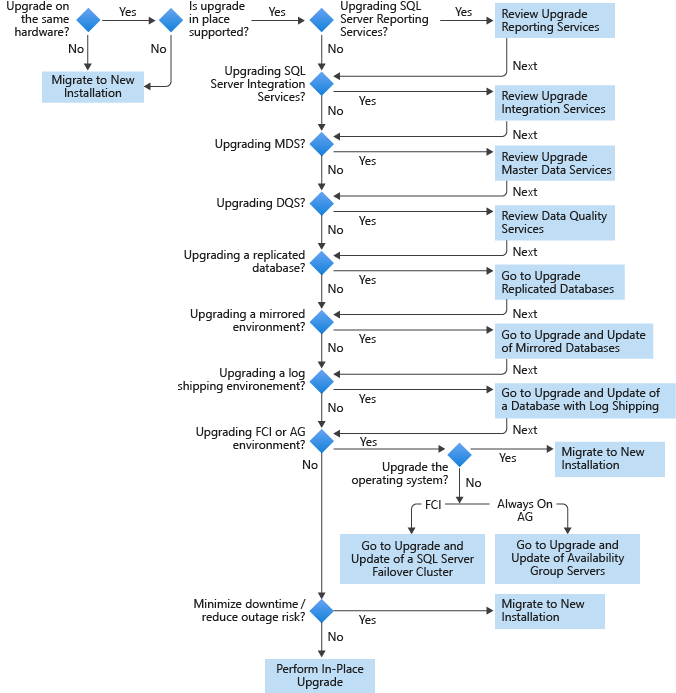
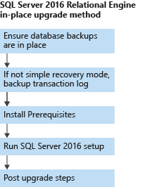
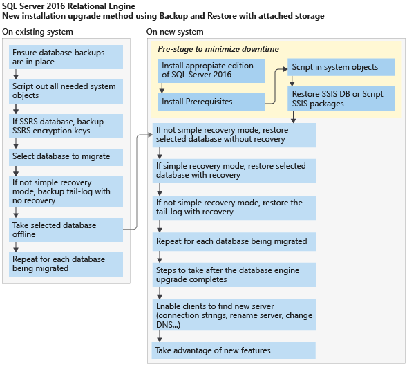
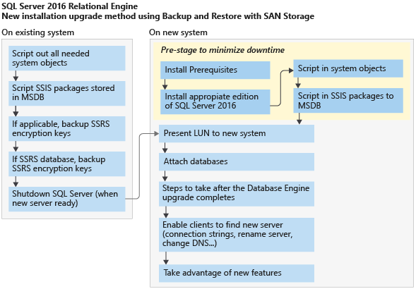

# Choose a database engine upgrade method
[!INCLUDE [SQL Server -Windows Only](../../includes/applies-to-version/sql-windows-only.md)]

There are several approaches to consider when you are planning to upgrade the [!INCLUDE[ssDE](../../includes/ssde-md.md)] from a prior release of SQL Server in order to minimize downtime and risk. You can perform an upgrade in-place, migrate to a new installation, or perform a rolling upgrade. The following diagram will help you to choose amongst these approaches. Each of the approaches in the diagram are also discussed below. To assist you with the decision points in the diagram, please also review [Plan and Test the Database Engine Upgrade Plan](../../database-engine/install-windows/plan-and-test-the-database-engine-upgrade-plan.md).  
  
   
  
 **Download**  
  
-   To download [!INCLUDE[SSnoversion](../../includes/ssnoversion-md.md)], go to  **[Evaluation Center](https://www.microsoft.com/evalcenter/evaluate-sql-server)**.  
  
-   Have an Azure account?  Then go **[Here](https://azuremarketplace.microsoft.com/marketplace/apps/microsoftsqlserver.sql2017-ws2019?tab=overview)** to spin up a Virtual Machine with [!INCLUDE[ssnoversion](../../includes/ssnoversion-md.md)] Developer Edition already installed.  
  
> [!NOTE]  
>  You may also consider upgrading the Azure SQL Database or virtualizing your SQL Server environment as part of your upgrade plan. These articles are out of scope for this article, but here are some links:
>   - [SQL Server on Azure Virtual Machines overview](https://azure.microsoft.com/services/virtual-machines/sql-server/#overview)
>   - [Azure SQL Database](https://azure.microsoft.com/services/sql-database/) 
>   - [Selecting a SQL Server option in Azure](/azure/azure-sql/azure-sql-iaas-vs-paas-what-is-overview).  
  
## Upgrade in-place  
 With this approach, the SQL Server setup program upgrades the existing [!INCLUDE[ssNoVersion](../../includes/ssnoversion-md.md)] installation by replacing the existing [!INCLUDE[ssNoVersion](../../includes/ssnoversion-md.md)] bits with the new [!INCLUDE[ssnoversion](../../includes/ssnoversion-md.md)] bits and then upgrades each of the system and user databases.  The upgrade in-place  approach is easiest, requires some amount of downtime, takes longer to fallback if a fallback is necessary, and it is not supported for all scenarios. For more information on supported and unsupported upgrade in-place scenarios, see [Supported Version and Edition Upgrades](../../database-engine/install-windows/supported-version-and-edition-upgrades-2017.md).  
  
 This approach is frequently used in the following scenarios:  
  
-   A development environment without a high-availability (HA) configuration.  
  
-   A non-mission critical production environment that can tolerate downtime and that is running on a recent hardware and software. The amount of downtime is dependent upon the size of your database and the speed of your I/O subsystem. Upgrading SQL Server 2014 when memory-optimized tables are in use will take some extra time. For more information, see [Plan and Test the Database Engine Upgrade Plan](../../database-engine/install-windows/plan-and-test-the-database-engine-upgrade-plan.md).  

> [!NOTE]
> For an example of how Microsoft has used this strategy, see the following blog post: [To upgrade or not to upgrade](https://azure.microsoft.com/blog/azure-sql-server-to-upgrade-or-not-to-upgrade-that-is-the-question/). 

> [!WARNING]  
>  When running the [!INCLUDE[ssNoVersion](../../includes/ssnoversion-md.md)] setup program, the [!INCLUDE[ssNoVersion](../../includes/ssnoversion-md.md)] instance is stopped and restarted as part of running the pre-upgrade checks.  
  
> [!CAUTION]  
>  When you upgrade [!INCLUDE[ssNoVersion](../../includes/ssnoversion-md.md)], the previous [!INCLUDE[ssNoVersion](../../includes/ssnoversion-md.md)] instance will be overwritten and will no longer exist on your computer. Before upgrading, back up [!INCLUDE[ssNoVersion](../../includes/ssnoversion-md.md)] databases and other objects associated with the previous [!INCLUDE[ssNoVersion](../../includes/ssnoversion-md.md)] instance.  
  
 The following diagram provides a high-level overview of the steps required for an in-place upgrade of the [!INCLUDE[ssDE](../../includes/ssde-md.md)].  
  
   
  
 For detailed steps, see [Upgrade SQL Server Using the Installation Wizard &#40;Setup&#41;](../../database-engine/install-windows/upgrade-sql-server-using-the-installation-wizard-setup.md).  
  
## Migrate to a new installation  
 With this approach, you maintain the current environment while you build a new [!INCLUDE[ssNoVersion](../../includes/ssnoversion-md.md)] environment, frequently on new hardware and with a new version of the operating system. After installing [!INCLUDE[ssNoVersion](../../includes/ssnoversion-md.md)] in the new environment, you perform a number of steps to prepare the new environment so that you can migrate the existing user databases from the existing environment to the new environment and minimize downtime. These steps include migrating the following:  
  
-   **System objects:** Some applications depend on information, entities, and/or objects that are outside of the scope of a single user database. Typically, an application has dependencies on the master and msdb databases, and also on the user database. Anything stored outside of a user database that is required for the correct functioning of that database must be made available on the destination server instance. For example, the logins for an application are stored as metadata in the master database, and they must be re-created on the destination server. If an application or database maintenance plan depends on SQL Server Agent jobs, whose metadata is stored in the msdb database, you must re-create those jobs on the destination server instance. Similarly, the metadata for a server-level trigger is stored in master.  
 
   When you move the database for an application to another server instance, you must re-create all the metadata of the dependent entities and objects in master and msdb on the destination server instance. For example, if a database application uses server-level triggers, just attaching or restoring the database on the new system is not enough. The database will not work as expected unless you manually re-create the metadata for those triggers in the master database. For detailed information, see [Manage Metadata When Making a Database Available on Another Server Instance &#40;SQL Server&#41;](../../relational-databases/databases/manage-metadata-when-making-a-database-available-on-another-server.md)  
  
-   **Integration Services packages stored in MSDB:** If you are storing packages in MSDB, you will need to either script out those packages using the [dtutil Utility](../../integration-services/dtutil-utility.md) or redeploy them to the new server. Before using the packages on the new server, you will need to upgrade the packages to [!INCLUDE[ssNoVersion](../../includes/ssnoversion-md.md)]. For more information, see [Upgrade Integration Services Packages](../../integration-services/install-windows/upgrade-integration-services-packages.md).  
  
-   **Reporting Services encryption keys:** An important part of report server configuration is creating a backup copy of the symmetric key used for encrypting sensitive information. A backup copy of the key is required for many routine operations, and enables you to reuse an existing report server database in a new installation. For more information, see [Back Up and Restore Reporting Services Encryption Keys](../../reporting-services/install-windows/ssrs-encryption-keys-back-up-and-restore-encryption-keys.md) and [Upgrade and Migrate Reporting Services](../../reporting-services/install-windows/upgrade-and-migrate-reporting-services.md)  
  
 Once the new   [!INCLUDE[ssNoVersion](../../includes/ssnoversion-md.md)] environment has the same system objects as the existing environment, you then migrate the user databases from the existing system to the [!INCLUDE[ssNoVersion](../../includes/ssnoversion-md.md)] instance in a manner that will minimize downtime on the existing system. You accomplish the database migration either using backup and restore, or by repointing LUNs if you are in a SAN environment. The steps for both methods are delineated in the diagrams below.  
  
> [!CAUTION]  
>  The amount of downtime is dependent upon the size of your database and the speed of your I/O subsystem. Upgrading SQL Server 2014 when memory-optimized tables are in use will take some extra time. For more information, see [Plan and Test the Database Engine Upgrade Plan](../../database-engine/install-windows/plan-and-test-the-database-engine-upgrade-plan.md).  
  
 After migrating the user database(s), you point new users to the new [!INCLUDE[ssNoVersion](../../includes/ssnoversion-md.md)] instance using one of a variety of methods (e.g. renaming the  server, using a DNS entry, modifying connection strings).  The new installation  approach reduces risk and downtime as compared to an in-place upgrade , and facilitates hardware and operating system upgrades in conjunction with the upgrade to [!INCLUDE[ssNoVersion](../../includes/ssnoversion-md.md)].  
  
> [!NOTE]  
>  If you already have a high availability (HA) solution in place or some other multiple [!INCLUDE[ssNoVersion](../../includes/ssnoversion-md.md)]instance environment, go [Rolling upgrade](#rolling-upgrade). If you do not have a high availability solution in place, you can consider either temporarily configuring [Database Mirroring](../database-mirroring/setting-up-database-mirroring-sql-server.md) to further minimize downtime to facilitate this upgrade or taking this opportunity to configure an [Always On Availability Group](../availability-groups/windows/configuration-of-a-server-instance-for-always-on-availability-groups-sql-server.md) as a   permanent HA solution.  
  
 For example, you may use this approach to upgrade:  
  
-   An installation of [!INCLUDE[ssNoVersion](../../includes/ssnoversion-md.md)] on an unsupported operating system.    
-   An x86 installation of SQL Server as [!INCLUDE[ss2016](../../includes/sssql15-md.md)] and later do not support x86 installations.   
-   [!INCLUDE[ssNoVersion](../../includes/ssnoversion-md.md)] to new hardware and/or a new version of the operating system.    
-   [!INCLUDE[ssNoVersion](../../includes/ssnoversion-md.md)] in conjunction with server consolidation.   
-   SQL Server 2005 as [!INCLUDE[ss2016](../../includes/sssql15-md.md)] and later do not support the in-place upgrade of SQL Server 2005. For more information, see [Are you upgrading from SQL Server 2005](../../sql-server/end-of-support/sql-server-end-of-life-overview.md).

  
The steps required for a new installation upgrade vary slightly depending upon whether you are using attached storage or SAN storage.  
  
-   **Attached storage environment:** If you have a [!INCLUDE[ssNoVersion](../../includes/ssnoversion-md.md)] environment using attached storage, the following diagram and the links within the diagram to guide you through the steps required for a new installation upgrade of the [!INCLUDE[ssDE](../../includes/ssde-md.md)].  
  
       
  
-   **SAN storage environment:**  If you have a [!INCLUDE[ssNoVersion](../../includes/ssnoversion-md.md)] environment using SAN storage, the following diagram and the links within the diagram to guide you through the steps required for a new installation upgrade of the [!INCLUDE[ssDE](../../includes/ssde-md.md)].  
  
       
  
## Rolling upgrade  
 A rolling upgrade is required in SQL Server solution environments involving multiple [!INCLUDE[ssNoVersion](../../includes/ssnoversion-md.md)] instances that must be upgraded in a certain order to maximize uptime, minimize risk, and preserve functionality. A rolling upgrade is essentially the upgrade of multiple [!INCLUDE[ssNoVersion](../../includes/ssnoversion-md.md)] instances in a particular order, either performing an upgrade in-place on each existing [!INCLUDE[ssNoVersion](../../includes/ssnoversion-md.md)] instance or performing a new installation upgrade to facilitate upgrading hardware and/or the operating system as part of the upgrade project. There are   a number of scenarios in which you need to use the rolling upgrade approach. These are documented in the following articles:  
  
-   Always-On Availability Groups: For detailed steps for performing a rolling upgrade in this environment, see [Upgrading Always On Availability Group Replica Instances](../../database-engine/availability-groups/windows/upgrading-always-on-availability-group-replica-instances.md).    
-   Failover cluster instances: For detailed steps for performing a rolling upgrade in this environment, see [Upgrade a SQL Server Failover Cluster Instance](../../sql-server/failover-clusters/windows/upgrade-a-sql-server-failover-cluster-instance.md)    
-   Mirrored instances: For detailed steps for performing a rolling upgrade in this environment, see [Upgrading Mirrored Instances](../../database-engine/database-mirroring/upgrading-mirrored-instances.md).    
-   Log shipping instances: For detailed steps for performing a rolling upgrade in this environment, see [Upgrading Log Shipping for SQL Server &#40;Transact-SQL&#41;](../../database-engine/log-shipping/upgrading-log-shipping-to-sql-server-2016-transact-sql.md).    
-   A replication environment: For detailed steps for performing a rolling upgrade in this environment, see [Upgrade Replicated Databases](../../database-engine/install-windows/upgrade-replicated-databases.md).  
-   A SQL Server Reporting Services scale-out environment: For detailed steps for performing a rolling upgrade in this environment, see [Upgrade and Migrate Reporting Services](../../reporting-services/install-windows/upgrade-and-migrate-reporting-services.md).  
  
## Next steps
 [Plan and Test the Database Engine Upgrade Plan](../../database-engine/install-windows/plan-and-test-the-database-engine-upgrade-plan.md)   
 [Complete the Database Engine Upgrade](../../database-engine/install-windows/complete-the-database-engine-upgrade.md)