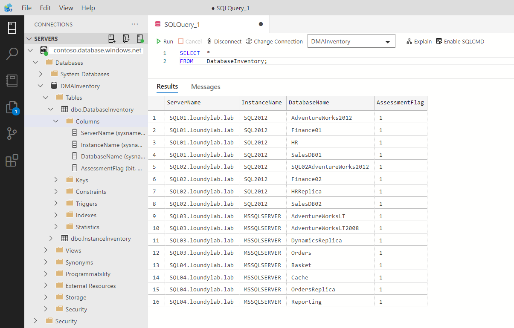
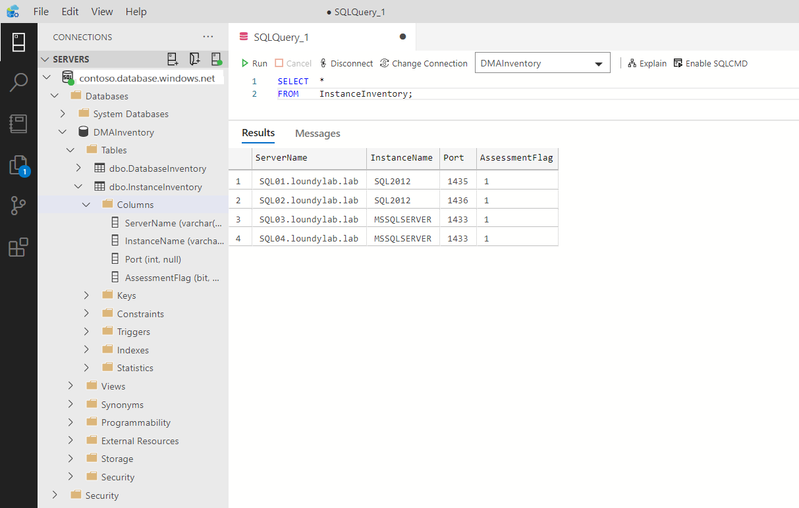
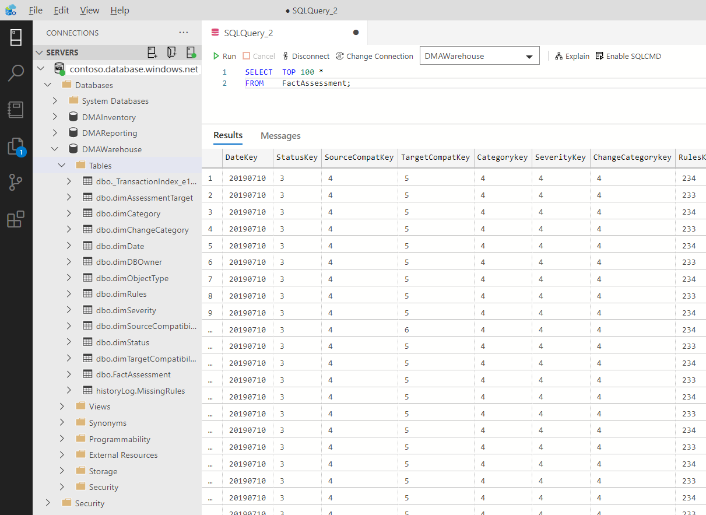
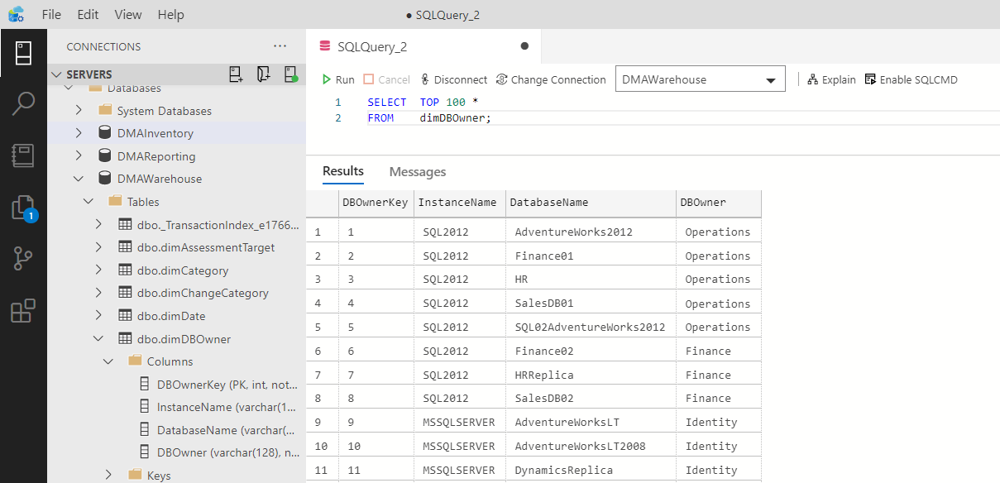
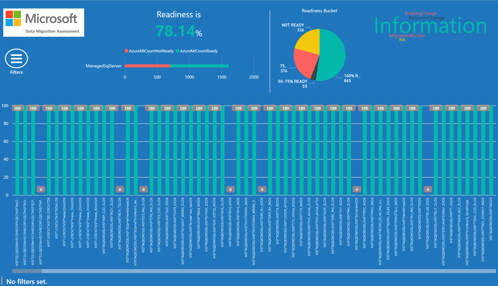
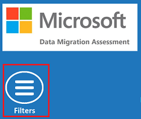
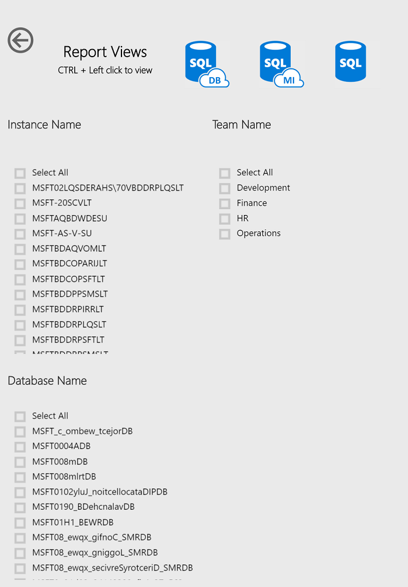

# Assess an enterprise and consolidate assessment reports with DMA

The following step-by-step instructions help you use the Data Migration Assistant to perform a successful scaled assessment for upgrading on-premises SQL Server or  SQL Server running on Azure VMs, or for migrating to Azure SQL Database.

## Prerequisites

- Designate a tools computer on your network from which DMA will be initiated. Ensure that this computer has connectivity to your SQL Server targets.
- Download and install:
  - [Data Migration Assistant](https://www.microsoft.com/download/details.aspx?id=53595) v3.6 or above.
  - [PowerShell](https://aka.ms/wmf5download) v5.0 or above.
  - [.NET Framework](https://www.microsoft.com/download/details.aspx?id=30653) v4.5 or above.
  - [SSMS](https://docs.microsoft.com/sql/ssms/download-sql-server-management-studio-ssms) 17.0 or above.
  - [Power BI desktop](/power-bi/fundamentals/desktop-get-the-desktop).
  - [Azure PowerShell Modules](https://docs.microsoft.com/powershell/azure/install-az-ps?view=azps-1.0.0)
- Download and extract:
  - The [DMA Reports Power BI template](https://techcommunity.microsoft.com/gxcuf89792/attachments/gxcuf89792/MicrosoftDataMigration/161/2/PowerBI-Reports.zip).
  - The [LoadWarehouse script](https://techcommunity.microsoft.com/gxcuf89792/attachments/gxcuf89792/MicrosoftDataMigration/161/3/LoadWarehouse1.zip).

## Loading the PowerShell modules

Saving the PowerShell modules into the PowerShell modules directory enables you to call the modules without the need to explicitly load them before use.

To load the modules, perform the following steps:

1. Navigate to C:\Program Files\WindowsPowerShell\Modules, and then create a folder named **DataMigrationAssistant**.
2. Open the [PowerShell-Modules](https://techcommunity.microsoft.com/gxcuf89792/attachments/gxcuf89792/MicrosoftDataMigration/161/1/PowerShell-Modules2.zip), and then save them into the folder you created.

      

    Each folder contains the associated psm1 file, as shown in the following graphic:

   

   > [!NOTE]
   > The folder and psm1 file it contains must have the same name.

   > [!IMPORTANT]
   > You may need to unblock the PowerShell files after you save them to the WindowsPowerShell directory to ensure that the modules to load correctly. To unblock a PowerShell file, right-click on the file, select **Properties**, select the **Unblock** text box, and then select **Ok**.

   

    PowerShell should now load these modules automatically when a new PowerShell session starts.

##  Create an inventory of SQL Servers

Before running the PowerShell script to assess your SQL Servers, you need to build an inventory of the SQL Servers that you want to assess.

This inventory can be in one of two forms:

- Excel CSV file
- SQL Server table

### If using a CSV file

> [!IMPORTANT]
> Ensure that the inventory file is saved as a comma-separated (CSV) file.
>
> For default instances, set the instance name to MSSQLServer.

When using a csv file to import the data, ensure there are only two columns of data - **Instance Name** and **Database Name**, and that the columns don't have header rows.

 

### If using a SQL Server table

> [!IMPORTANT]
> For default instances, set the instance name to MSSQLServer.

Create a database called **EstateInventory** and a table called **DatabaseInventory**. The table containing this inventory data can have any number of columns, as long as following four columns exist:

- ServerName
- InstanceName
- DatabaseName
- AssessmentFlag

If this database isn't on the tools computer, ensure that the tools computer has network connectivity to this SQL Server instance.

The benefit of using a SQL Server table over a CSV file is that you can use the assessment flag column to control the instance / database that gets picked up for assessment, which makes it easier to separate assessments into smaller chunks.  You can then span multiple assessments (see the section on running an assessment later in this article), which is easier than maintaining multiple CSV files.

Keep in mind that depending on the number of objects and their complexity, an assessment can take an exceptionally long time (hours+), so it's prudent to separate the assessment into manageable chunks.

### If using an Instance Inventory

Create a database called **EstateInventory** and a table called **InstanceInventory**. The table containing this inventory data can have any number of columns, as long as following four columns exist:

- ServerName
- InstanceName
- Port
- AssessmentFlag

## Running a scaled assessment

After loading the PowerShell modules into the modules directory and creating an inventory, you need to run a scaled assessment by opening PowerShell and running the dmaDataCollector function.

  

The parameters associated with the dmaDataCollector function are described in the following table.

|Parameter  |Description |
|---------|---------|
|**getServerListFrom** | Your inventory. Possible values are **SqlServer** and **CSV**. For more info, see [Create an inventory of SQL Servers](#create-inventory). |
|**csvPath** | The path to your CSV inventory file.  Used only when **getServerListFrom** is set to  **CSV**. |
|**serverName** | The SQL Server instance name of the inventory when using **SqlServer** in the **getServerListFrom** parameter. |
|**databaseName** | The database hosting the inventory table. |
|**useInstancesOnly** | Bit flag to specify whether to use a list of Instances for assessment or not.  If set to 0, then the DatabaseInventory table will be used to build the assessment target list. |
|**AssessmentName** | The name of the DMA assessment. |
|**TargetPlatform** | The assessment target type that you want to perform.  Possible values are **AzureSQLDatabase**, **ManagedSqlServer**, **SQLServer2012**, **SQLServer2014**, **SQLServer2016**, **SQLServerLinux2017**, **SQLServerWindows2017**,  **SqlServerWindows2019**, and **SqlServerLinux2019**.  |
|**AuthenticationMethod** | The authentication method for connecting to the SQL Server targets you want to assess. Possible values are **SQLAuth** and **WindowsAuth**. |
|**OutputLocation** | The directory in which to storing the JSON assessment output file. Depending on the number of databases being assessed and the number of objects within the databases, the assessments can take an exceptionally long time. The file will be written after all assessments have completed. |

If there is an unexpected error, then the command window that gets initiated by this process will be terminated.  Review the error log to determine why it failed.

  

## Consuming the assessment JSON file

After your assessment has finished, you're now ready to import the data into SQL Server for analysis. To consume the assessment JSON file, open PowerShell and run the dmaProcessor function.

  

The parameters associated with the dmaProcessor function are described in the following table.

|Parameter  |Description |
|---------|---------|
|**processTo** | The location to which the JSON file will be processed. Possible values are **SQLServer** and **AzureSQLDatabase**. |
|**serverName** | The SQL Server instance to which data will be processed.  If you specify **AzureSQLDatabase** for the **processTo** parameter, then include only the SQL Server name (don't include .database.windows.net). You'll be prompted for two logins when targeting Azure SQL Database; the first is your Azure tenant credentials, while the second is your admin login for the Azure SQL Server. |
|**CreateDMAReporting** | The staging database to create for processing the JSON file.  If the database you specify already exists and you set this parameter to one, then objects don't get created.  This parameter is useful for recreating a single object that has been dropped. |
|**CreateDataWarehouse** | Creates the data warehouse that will be used by the Power BI report. |
|**databaseName** | The name of the DMAReporting database. |
|**warehouseName** | The name of the data warehouse database. |
|**jsonDirectory** | The directory containing the JSON assessment file.  If there are multiple JSON files in the directory, then they're processed one by one. |

The dmaProcessor function should only take a few seconds to process a single file.

## Loading the data warehouse

After the dmaProcessor has finishing processing the assessment files, the data will be loaded into the DMAReporting database in the ReportData table. At this point, you need to load the data warehouse.

1. Use the LoadWarehouse script to populate any missing values in the dimensions.

    The script will take the data from the ReportData table in the DMAReporting database and load it into the warehouse.  If there are any errors during this load process, they're likely a result of missing entries in the dimension tables.

2. Load the data warehouse.

  

## Set your database owners

While it's not mandatory, to get the most value from the reports, it's recommended that you set the database owners in the **dimDBOwner** dimension, and then update **DBOwnerKey** in the **FactAssessment** table.  Following this process will allow slicing and filtering the Power BI report based on specific database owners.

You can also use the LoadWarehouse script to provide the basic TSQL statements for you to set the database owners.

  

## DMA reports

1. Open the DMA Reports Power BI template in the Power BI Desktop.
2. Enter server details that point to your **DMAWarehouse** database, and then select **Load**.

   

   After the report has refreshed the data from the **DMAWarehouse** database, you're presented with a report similar to the following.

   

   > [!TIP]
   > If you do not see the data you were expecting, try changing the active bookmark.  For more information, see the detail in the following section.

## Working with DMA reports

To work with DMA reports, use bookmarks and slicers to filter by:

- Assessment types (Azure SQL DB, Azure SQL MI, SQL on-premises) 
- Instance Name
- Database Name
- Team Name

To access the bookmarks and filters blade, select the filters bookmark on the main report page:

Selecting the filters bookmark enables the following blade:

You can use Bookmarks to switch the reporting context between:

- Azure SQL DB cloud assessments
- Azure SQL MI cloud assessments
- On-premises assessments

To hide the filters blade, CTRL-click the Back button:

There is a prompt at the bottom-left of the report page to show whether a filter is currently applied on any of the following items:

- FactAssessment – InstanceName
- FactAssessment – DatabaseName
- dimDBOwner - DBOwner

> [!NOTE]
> If you only perform an Azure SQL Database assessment, then only Cloud reports are populated. Conversely, if you only perform an on-premises assessment, only On-Premise reports are populated. However, if you perform both an Azure and an On-Premise assessment and then load both assessments into your warehouse, you can switch between Cloud reports and On-Premise reports by CTRL-clicking the associated icon.

## Reports visuals

The detail displayed in the Power BI reports is shown in the following sections.

### Readiness %

  

This visual is updated based on the selection context (everything, instance, database [multiples of]).

### Readiness count

  

This visual shows the count of databases that are ready to migrate the count of databases that are not yet ready to migrate.

### Readiness bucket

  

This visual shows a breakdown of databases by the following readiness buckets:

- 100% READY
- 75-99% READY
- 50-75% READY
- NOT READY

### Issues Word Cloud

  

This visual shows the issues that are currently occurring within in the selection context (everything, instance, database [multiples of]). The larger the word appears on-screen, the greater the number of issues in that category. Hovering the mouse pointer over a word shows the number of issues occurring in that category.

### Database Readiness

  

This section is the primary part of the report, which shows the readiness of an instance-database. This report has a drill-down hierarchy of:

- InstanceDatabase
- ChangeCategory
- Title
- ObjectType
- ImpactedObjectName

 

This report also serves as the filter point for creating the Remediation Plan Report.

To drill into the Remediation Plan Report, right-click on a data point in this graph, point to **Drillthrough**, and then select **Remediation Plans**.

This task filters the remediation plan report to the current hierarchy level based on the point at which you select the drill through option.

  

  

You can also use the Remediation Plan report on its own to build a custom remediation plan by using the filters in the **Visualizations Filters** blade.

  

### Script Disclaimer

*The sample scripts provided in this article are not supported under any Microsoft standard support program or service. All scripts are provided AS IS without warranty of any kind. Microsoft further disclaims all implied warranties including, without limitation, any implied warranties of merchantability or of fitness for a specific purpose. The entire risk arising out of the use or performance of the sample scripts and documentation remains with you. In no event shall Microsoft, its authors, or anyone else involved in the creation, production, or delivery of the scripts be liable for any damages whatsoever (including, without limitation, damages for loss of business profits, business interruption, loss of business information, or other pecuniary loss) arising out of the use of or inability to use the sample scripts or documentation, even if Microsoft has been advised of the possibility of such damages.  Seek permission before reposting these scripts on other sites/repositories/blogs.*
