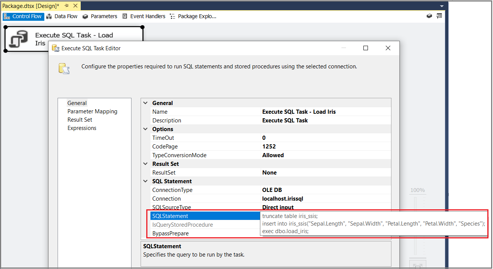
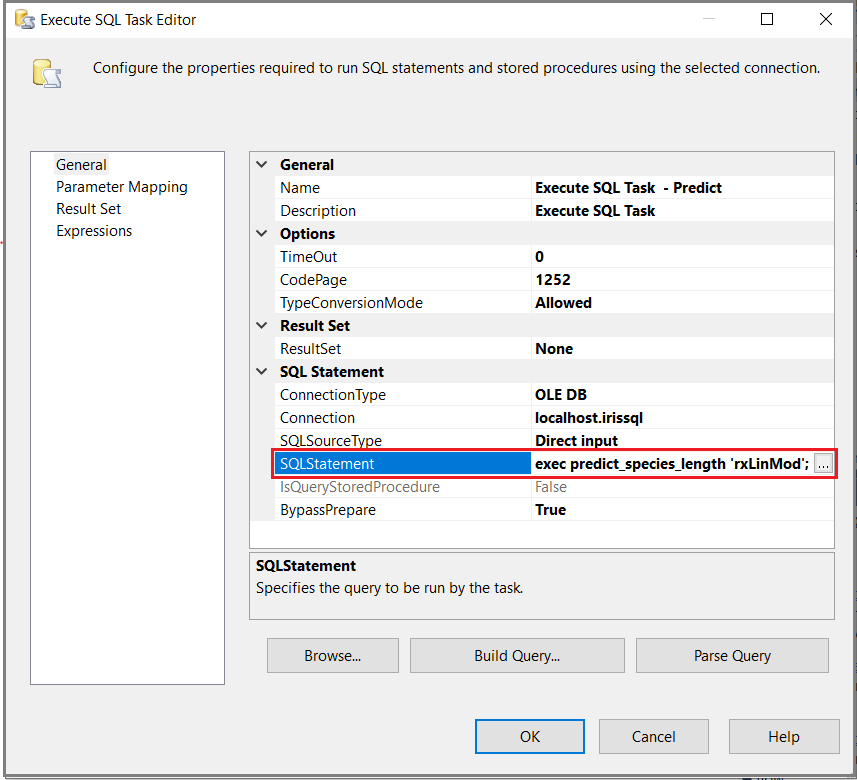

# Create SSIS and SSRS workflows with R on SQL Server
[!INCLUDE[appliesto-ss-xxxx-xxxx-xxx-md](../../includes/appliesto-ss-xxxx-xxxx-xxx-md.md)]

This article explains how to use embedded R and Python script using the language and data science capabilities of SQL Server Machine Learning Services with two important SQL Server features: SQL Server Integration Services (SSIS) and SQL Server Reporting Services SSRS. R and Python libraries in SQL Server provide statistical and predictive functions. SSIS and SSRS provide coordinated ETL transformation and visualizations, respectively. This article explains how to put all of these features together in this workflow pattern:

> [!div class="checklist"]
> * Create a stored procedure that contains executable R or Python
> * Execute the stored procedure from SSIS or SSRS

The examples in this article are mostly about R and SSIS, but the concepts and steps apply equally to Python. The second section provides guidance and links for SSRS visualizations.

<a name="bkmk_ssis"></a> 

## Use SSIS for automation

Data science workflows are highly iterative and involve much transformation of data, including scaling, aggregations, computation of probabilities, and renaming and merging of attributes. Data scientists are accustomed to doing many of these tasks in R, Python, or another language; however, executing such workflows on enterprise data requires seamless integration with ETL tools and processes.

Because [!INCLUDE[rsql_productname](../../includes/rsql-productname-md.md)] enables you to run complex operations in R via Transact-SQL and stored procedures, you can integrate data science tasks with existing ETL processes. Rather than perform a chain of memory-intensive tasks, data preparation can be optimized using the most efficient tools, including [!INCLUDE[ssISnoversion](../../includes/ssisnoversion-md.md)] and [!INCLUDE[tsql](../../includes/tsql-md.md)]. 

Here are some ideas for how you can automate your data processing and modeling pipelines using [!INCLUDE[ssISnoversion](../../includes/ssisnoversion-md.md)]:

+ Extract data from on premises or cloud sources to build training data 
+ Build and run R or Python models as part of a data integration workflow
+ Retrain models on a regular (scheduled) basis
+ Load results from R or Python script to other destinations such as Excel, Power BI, Oracle, and Teradata, to name a few
+ Use SSIS tasks to create data features in the SQL database
+ Use conditional branching to switch compute context for R and Python jobs

## SSIS example

The following example originates from a now-retired MSDN blog post authored by Jimmy Wong at this URL: `https://blogs.msdn.microsoft.com/ssis/2016/01/11/operationalize-your-machine-learning-project-using-sql-server-2016-ssis-and-r-services/`

This example shows you how to automate tasks using SSIS. You create stored procedures with embedded R using SQL Server Management Studio, and then execute those stored procedures from [Execute T-SQL tasks](https://docs.microsoft.com/sql/integration-services/control-flow/execute-t-sql-statement-task) in an SSIS package.

To step through this example, you should be familiar with Management Studio, SSIS, SSIS Designer, package design, and T-SQL. The SSIS package uses three [Execute T-SQL tasks](https://docs.microsoft.com/sql/integration-services/control-flow/execute-t-sql-statement-task) that insert training data into a table, model the data, and score the data to get prediction output.

### Load training data

Run the following script in SQL Server Management Studio to create a table for storing the data. You should create and use a test database for this exercise. 

```T-SQL
Use test-db
GO

Create table ssis_iris (
	id int not null identity primary key
	, "Sepal.Length" float not null, "Sepal.Width" float not null
	, "Petal.Length" float not null, "Petal.Width" float not null
	, "Species" varchar(100) null
);
GO
```

Create a stored procedure that loads training data into data frame. This example is using the built-in Iris data set. 

```T-SQL
Create procedure load_iris
as
begin
	execute sp_execute_external_script
		@language = N'R'
		, @script = N'iris_df <- iris;'
		, @input_data_1 = N''
		, @output_data_1_name = N'iris_df'
	with result sets (("Sepal.Length" float not null, "Sepal.Width" float not null, "Petal.Length" float not null, "Petal.Width" float not null, "Species" varchar(100)));
end;
```

In SSIS Designer, create an [Execute SQL task](https://docs.microsoft.com/sql/integration-services/control-flow/execute-sql-task) that executes the stored procedure you just defined. The script for **SQLStatement** removes existing data, specifies which data to insert, and then calls the stored procedure to provide the data.

```T-SQL
truncate table ssis_iris;
insert into ssis_iris("Sepal.Length", "Sepal.Width", "Petal.Length", "Petal.Width", "Species")
exec dbo.load_iris;
```



### Generate a model

Run the following script in SQL Server Management Studio to create a table that stores a model. 

```T-SQL
Use test-db
GO

Create table ssis_iris_models (
	model_name varchar(30) not null default('default model') primary key,
	model varbinary(max) not null
);
GO
```

Create a stored procedure that generates a linear model using [rxLinMod](https://docs.microsoft.com/machine-learning-server/r-reference/revoscaler/rxlinmod). RevoScaleR and revoscalepy libraries are automatically available in R and Python sessions on SQL Server so there is no need to import the library.

```T-SQL
Create procedure generate_iris_rx_model
as
begin
	execute sp_execute_external_script
		@language = N'R'
		, @script = N'
		  irisLinMod <- rxLinMod(Sepal.Length ~ Sepal.Width + Petal.Length + Petal.Width + Species, data = ssis_iris);
		  trained_model <- data.frame(payload = as.raw(serialize(irisLinMod, connection=NULL)));'
		, @input_data_1 = N'select "Sepal.Length", "Sepal.Width", "Petal.Length", "Petal.Width", "Species" from ssis_iris'
		, @input_data_1_name = N'ssis_iris'
		, @output_data_1_name = N'trained_model'
	with result sets ((model varbinary(max)));
end;
GO
```

In SSIS Designer, create an [Execute SQL task](https://docs.microsoft.com/sql/integration-services/control-flow/execute-sql-task) to execute the **generate_iris_rx_model** stored procedure. The model is serialized and saved to the ssis_iris_models table. The script for **SQLStatement** is as follows:

```T-SQL
insert into ssis_iris_models (model)
exec generate_iris_rx_model;
update ssis_iris_models set model_name = 'rxLinMod' where model_name = 'default model';
```


As a checkpoint, after this task completes, you can query the ssis_iris_models to see that it contains one binary model.

### Predict (score) outcomes using the "trained" model

Now that you have code that loads training data and generates a model, the only step left is using the model to generate predictions. 

To do this, put the R script in the SQL query to trigger the [rxPredict](https://docs.microsoft.com//machine-learning-server/r-reference/revoscaler/rxpredict) built-in R function on ssis_iris_model. A stored procedure called **predict_species_length** accomplishes this task.

```T-SQL
Create procedure predict_species_length (@model varchar(100))
as
begin
	declare @rx_model varbinary(max) = (select model from ssis_iris_models where model_name = @model);
	-- Predict based on the specified model:
	exec sp_execute_external_script
		@language = N'R'
		, @script = N'
irismodel <-unserialize(rx_model);
irispred <- rxPredict(irismodel, ssis_iris[,2:6]);
OutputDataSet <- cbind(ssis_iris[1], irispred$Sepal.Length_Pred, ssis_iris[2]);
colnames(OutputDataSet) <- c("id", "Sepal.Length.Actual", "Sepal.Length.Expected");
#OutputDataSet <- subset(OutputDataSet, Species.Length.Actual != Species.Expected);
'
	, @input_data_1 = N'
	select id, "Sepal.Length", "Sepal.Width", "Petal.Length", "Petal.Width", "Species" from ssis_iris
	'
	, @input_data_1_name = N'ssis_iris'
	, @params = N'@rx_model varbinary(max)'
	, @rx_model = @rx_model
	with result sets ( ("id" int, "Species.Length.Actual" float, "Species.Length.Expected" float)
		);
end;
```

In SSIS Designer, create an [Execute SQL task](https://docs.microsoft.com/sql/integration-services/control-flow/execute-sql-task) that executes the **predict_species_length** stored procedure to generate predicted petal length.

```T-SQL
exec predict_species_length 'rxLinMod';
```



### Run the solution

In SSIS Designer, press F5 to execute the package. You should see an outcome similar to the following screenshot.


<a name="bkmk_ssrs"></a> 

## Use SSRS for visualizations

Although R can create charts and interesting visualizations, it is not well-integrated with external data sources, meaning that each chart or graph has to be individually produced. Sharing also can be difficult.

By using [!INCLUDE[rsql_productname](../../includes/rsql-productname-md.md)], you can run complex operations in R via [!INCLUDE[tsql](../../includes/tsql-md.md)] stored procedures, which can easily be consumed by a variety of enterprise reporting tools, including [!INCLUDE[ssRSnoversion](../../includes/ssrsnoversion-md.md)] and Power BI.

### SSRS example

[R Graphics Device for Microsoft Reporting Services (SSRS)](https://rgraphicsdevice.codeplex.com/)

This CodePlex project provides the code to help you create a custom report item that renders the graphics output of R as an image that can be used in [!INCLUDE[ssRSnoversion](../../includes/ssrsnoversion-md.md)] reports.  By using the custom report item, you can:

+ Publish charts and plots created using the R Graphics Device to [!INCLUDE[ssRSnoversion](../../includes/ssrsnoversion-md.md)] dashboards

+ Pass [!INCLUDE[ssRSnoversion](../../includes/ssrsnoversion-md.md)] parameters to R plots

> [!NOTE]
> For this sample, the code that supports the R Graphics Device for Reporting Services must be installed on the Reporting Services server, as well as in Visual Studio. Manual compilation and configuration is also required.

## Next steps

The SSIS and SSRS examples in this article illustrate two cases of executing stored procedures that contain embedded R or Python script. A key takeaway is that you can make R or Python script available to any application or tool that can send an execution request on a stored procedure. An additional takeaway for SSIS is that you can create packages that automate and schedule wide range of operations, such as data acquisition, cleansing, manipulation, and so forth, with R or Python data science functionality included in the chain of operations. For more information and ideas, see [Operationalize R code using stored procedures in SQL Server Machine Learning Services](operationalizing-your-r-code.md).