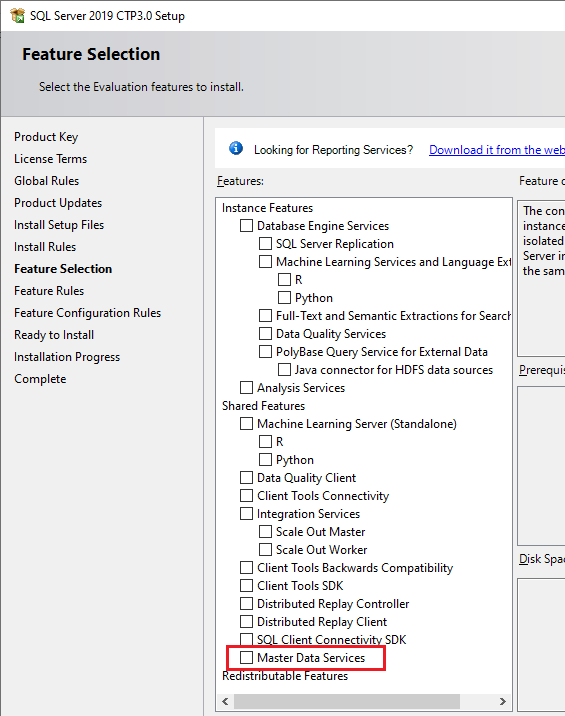
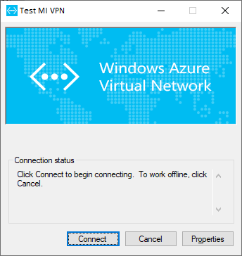
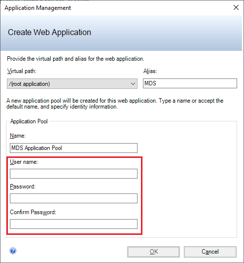
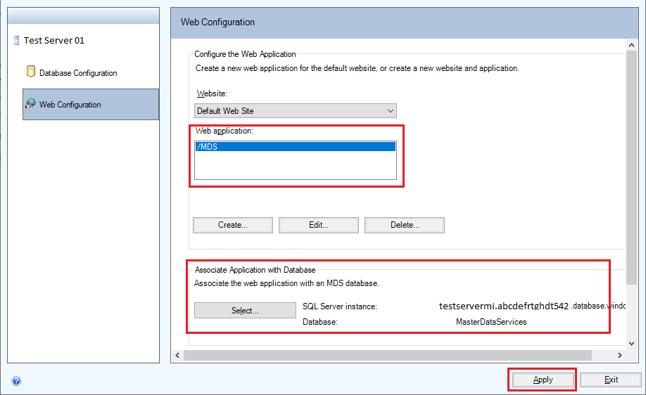
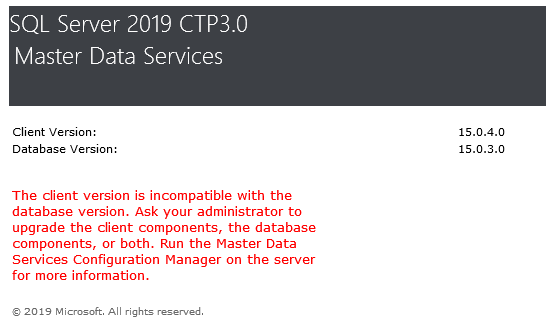
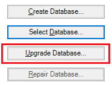
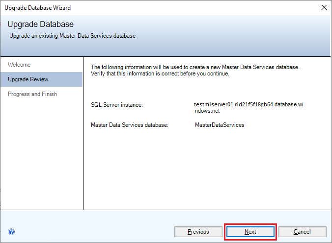

# Host database on managed instance

[!INCLUDE[appliesto-ss-xxxx-xxxx-xxx-md-winonly](../includes/appliesto-ss-xxxx-xxxx-xxx-md-winonly.md)]

  This article covers how to config a MDS database on managed instance.
  
## Preparation

We need finish following steps in the preparation.
- Finish managed instance creating and configuration. Include virtual network and Point-to-site VPN.
- Finish web application machine configuration.
  - Include install Point-to-site VPN.
  - Install Roles and Features.

**Database side:**

1. Create an Azure SQL Database managed instance include Virtual network. [Quickstart: Create an Azure SQL Database managed instance](https://docs.microsoft.com/azure/sql-database/sql-database-managed-instance-get-started)
2. Configure a Point-to-Site connection. [Configure a Point-to-Site connection to a VNet using native Azure certificate authentication: Azure portal](https://docs.microsoft.com/azure/vpn-gateway/vpn-gateway-howto-point-to-site-resource-manager-portal)
3. Configure Azure Active Directory authentication with SQL Database managed instance. [Configure and manage Azure Active Directory authentication with SQL](https://docs.microsoft.com/azure/sql-database/sql-database-aad-authentication-configure)

**Web application machine side:**

1. Install Point-to-Site connection certificate and VPN to ensure the machine can access SQL Database managed instance. [Configure a Point-to-Site connection to a VNet using native Azure certificate authentication: Azure portal](https://docs.microsoft.com/azure/vpn-gateway/vpn-gateway-howto-point-to-site-resource-manager-portal)
2. Install Role and Features. Following feature are required.

- Roles:

      Internet Information Services
      Web Management Tools
      IIS Management Console
      World Wide Web Services
      Application Development
      .NET Extensibility 3.5
      .NET Extensibility 4.5
      ASP.NET 3.5
      ASP.NET 4.5
      ISAPI Extensions
      ISAPI Filters
      Common HTTP Features
      Default Document
      Directory Browsing
      HTTP Errors
      Static Content
      [Note: Do not install WebDAV Publishing]
      Health and Diagnostics
      HTTP Logging
      Request Monitor
      Performance
      Static Content Compression
      Security
      Request Filtering
      Windows Authentication

- Features:

      .NET Framework 3.5 (includes .NET 2.0 and 3.0)
      .NET Framework 4.5 Advanced Services
      ASP.NET 4.5
      WCF Services
      HTTP Activation [Note: This is required.]
      TCP Port Sharing
      Windows Process Activation Service
      Process Model
      .NET Environment
      Configuration APIs
      Dynamic Content Compression

## Install and Configure [!INCLUDE[ssMDSshort_md](../includes/ssmdsshort-md.md)] Web application

We need finish following steps to install and configure [!INCLUDE[ssMDSshort_md](../includes/ssmdsshort-md.md)].

1. Install SQL Server 2019 include [!INCLUDE[ssMDSshort_md](../includes/ssmdsshort-md.md)] feature.
2. Create a [!INCLUDE[ssMDSshort_md](../includes/ssmdsshort-md.md)] database on Management Instance.
3. Create and configure web application for [!INCLUDE[ssMDSshort_md](../includes/ssmdsshort-md.md)].
  
**Install SQL Server 2019**

You use the SQL Server setup installation wizard or a command prompt to install [!INCLUDE[ssMDSshort_md](../includes/ssmdsshort-md.md)].

1. Double-click Setup.exe, and follow the steps in the installation wizard.

2. Select [!INCLUDE[ssMDSshort_md](../includes/ssmdsshort-md.md)] on the Feature Selection page under Shared Features.
This installs [!INCLUDE[ssMDScfgmgr](../includes/ssmdscfgmgr-md.md)], assemblies, a Windows PowerShell snap-in, and folders and files for Web applications and services.

      

**Setting up the Database and Website**

1. Connect the Windows Azure Virtual Network to ensure that you can connect to the managed instance.

      

2. Launch the [!INCLUDE[ssMDScfgmgr](../includes/ssmdscfgmgr-md.md)]. And click **Database Configuration** in the left pane.

3. Click **Create Database**, and then click Next in the **Create Database** Wizard.

4. On the **Database Server** page, fill the **SQL Server instance** and select the **Authentication type** and then click **Test Connection** to confirm that you can connect to the database using the credentials for the authentication type you selected. Click Next.

   > [!NOTE]
   > - SQL Server instance for managed instance like "xxxxxxx.xxxxxxx.database.windows.net"
   > - For managed instance, we support **"SQL Server Account"** and **"Current User – Active Directory Integrated"** authentication type.
   > - When you select **Current User – Active Directory Integrated** as the authentication type, **User name** box is read-only and displays the name of the Windows user account that is logged on to the computer. If you are running SQL Server 2019 [!INCLUDE[ssMDSshort_md](../includes/ssmdsshort-md.md)] on an Azure Virtual Machine (VM), the **User name** box displays the VM name and the user name for the local administrator account on the VM.

    Please ensure your authentication contains **"sysadmin"** rule for managed instance.
  

5. Type a name in the **Database name** field. Optionally, to select a Windows collation, clear the **SQL Server default collation** checkbox and click one or more of the available options such as **Case-sensitive**. Click **Next**.

      

6. In the **User name** field, specify the Windows account of the user that will be the default Super User for [!INCLUDE[ssMDSshort_md](../includes/ssmdsshort-md.md)]. A Super User has access to all functional areas and can add, delete, and update all models.

    

7. Click **Next** to view a summary of the settings for the [!INCLUDE[ssMDSshort_md](../includes/ssmdsshort-md.md)] database, and then click **Next** again to create the database. The **Progress and Finish** page appears.

8. When the database is created and configured, click **Finish**.

    For more information about the settings in the **Create Database Wizard**, see [Create Database Wizard &#40;[!INCLUDE[ssMDSshort_md](../includes/ssmdsshort-md.md)] Configuration Manager&#41;](../master-data-services/create-database-wizard-master-data-services-configuration-manager.md).

9. On the **Database Configuration** page in the [!INCLUDE[ssMDScfgmgr](../includes/ssmdscfgmgr-md.md)], click **Select Database**.

10. Click **Connect**, select the [!INCLUDE[ssMDSshort_md](../includes/ssmdsshort-md.md)] database that you created in Step 8, and then click **OK**.

    

11. In [!INCLUDE[ssMDScfgmgr](../includes/ssmdscfgmgr-md.md)], and click **Web Configuration** in the left pane.

12. In the **Website** list box, click **Default Web Site**, and then click **Create** to create a Web application.


   > [!NOTE] 
   > When you select **Default Web Site**, you must create a Web application. If you select **Create new website** in the list box, the application is automatically created.

    

13. In the **Application Pool** section, enter a different user name, enter the password, and then click OK.


   > [!NOTE]
   > You need ensure the user can access the database with Active Directory Integrated authentication that you just created. Or you need change the connection in web.config later.

    

14. For more information about the **Create Web Application** dialog box, see [Create Web Application Dialog Box &#40;[!INCLUDE[ssMDSshort_md](../includes/ssmdsshort-md.md)] Configuration Manager&#41;](../master-data-services/create-web-application-dialog-box-master-data-services-configuration-manager.md).

15. On the **Web Configuration** page in the **Web application** box, click the application you've created, and then click **Select** in the **Associate Application with Database** section.

16. Click **Connect**, select the [!INCLUDE[ssMDSshort_md](../includes/ssmdsshort-md.md)] database that you want to associate with the Web application, and then click **OK**.

    You've finished setting up the Website. The **Web Configuration** page now displays the Website you selected, Web application you created, and the [!INCLUDE[ssMDSshort_md](../includes/ssmdsshort-md.md)] database associated with the application.

    

17. Click **Apply**. The **Configuration Complete** message box displays. Click **OK** in the message box to launch the web application. The web site address is http://server name/web application/.

## Other authentication type to connect managed instance database on Web application

We can get the **web.config** file under C:\Program Files\Microsoft SQL Server\150\Master Data Services\WebApplication. We can modify the connectionString to change other authentication type to connect managed instance database.

The default authentication type is "**Active Directory Integrated**", following is the sample connection string.

```xml
<add name="MDS1" connectionString="Data Source=*****.*****.database.windows.net;Initial Catalog=MasterDataServices;Integrated Security=False;Connect Timeout=60;Authentication=&quot;Active Directory Integrated&quot;" />
```

We also support Active Directory password authentication and SQL Server Authentication, following is the sample connection string.

Active Directory password authentication

```xml
<add name="MDS1" connectionString="Data Source=*****.*****.database.windows.net;Initial Catalog=MasterDataServices;Integrated Security=False;Connect Timeout=60;Authentication=&quot;Active Directory Password&quot; ; UID=bob@contoso.onmicrosoft.com; PWD=MyPassWord!" />
```

SQL Server Authentication

```xml
<add name="MDS1" connectionString="Data Source=*****.*****.database.windows.net;Initial Catalog=MasterDataServices;Integrated Security=False;Connect Timeout=60;User ID=UserName;Password=MyPassword!;" />
```

## Upgrade [!INCLUDE[ssMDSshort_md](../includes/ssmdsshort-md.md)] and Database version

**Upgrade [!INCLUDE[ssMDSshort_md](../includes/ssmdsshort-md.md)]**

Install the SQL Server 2019 **Cumulative Update**, the [!INCLUDE[ssMDSshort_md](../includes/ssmdsshort-md.md)] will be updated automatically.

**Upgrade Database version**

If you receive “The client version is incompatible with the database version” issue after install SQL Server 2019 **Cumulative Update**, you need upgrade the Database version.



1. Launch the [!INCLUDE[ssMDScfgmgr](../includes/ssmdscfgmgr-md.md)]. And click **Database Configuration** in the left pane.

2. On the **Database Configuration** page in the [!INCLUDE[ssMDScfgmgr](../includes/ssmdscfgmgr-md.md)], click **Select Database**.

3. Click **Connect**, select the [!INCLUDE[ssMDSshort_md](../includes/ssmdsshort-md.md)] database that you associated for web application, and then click **OK**.

    

4. Click **Upgrade Database…** button

    

5. In the Upgrade Database Wizard, Click **Next** button on **Welcome** page and **Upgrade Review** page.

    

6. Click **Finish** button when all task completed.

## See Also

 [Master Data Services Database](../master-data-services/master-data-services-database.md)
 [Master Data Manager Web Application](../master-data-services/master-data-manager-web-application.md)
 [Database Configuration Page &#40;Master Data Services Configuration Manager&#41;](../master-data-services/database-configuration-page-master-data-services-configuration-manager.md)
 [What's New in Master Data Services &#40;MDS&#41;](../master-data-services/what-s-new-in-master-data-services-mds.md)
