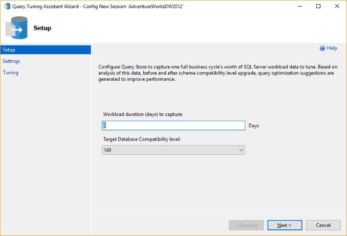
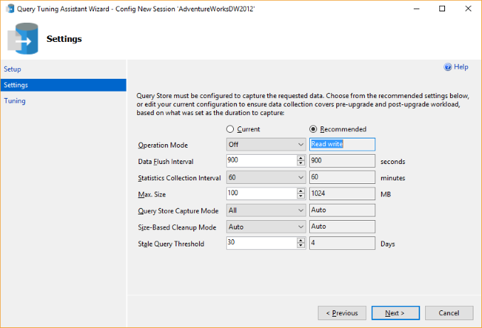
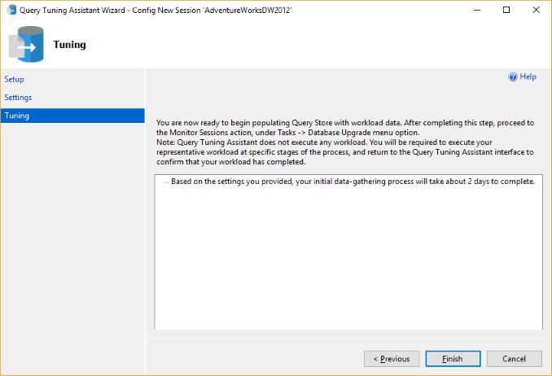
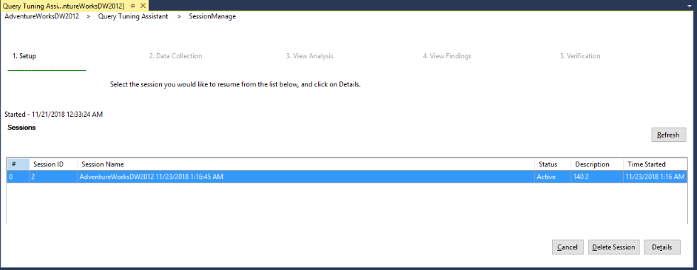
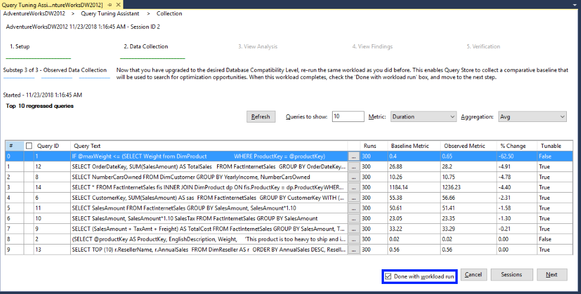
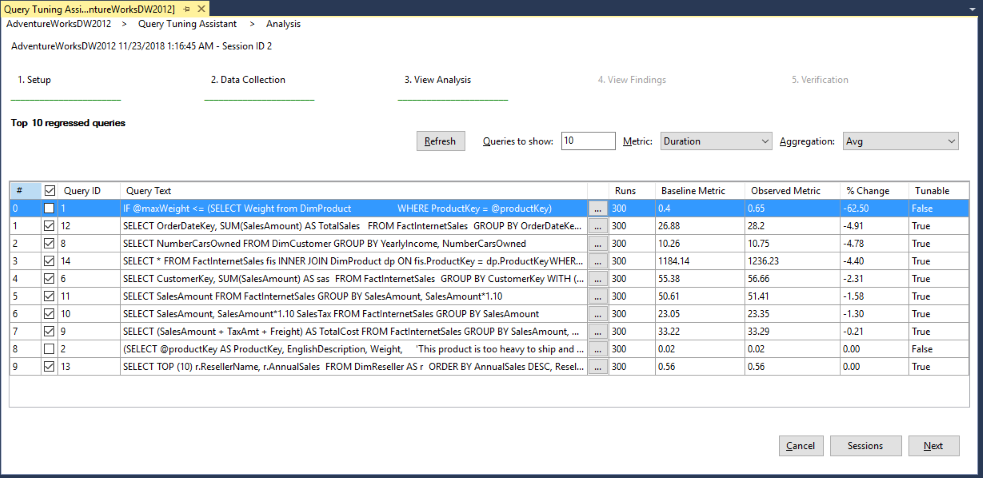
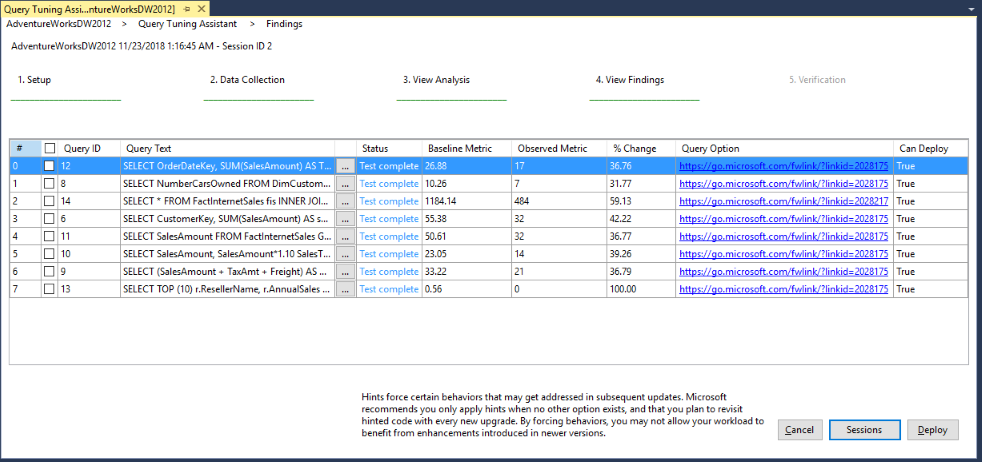
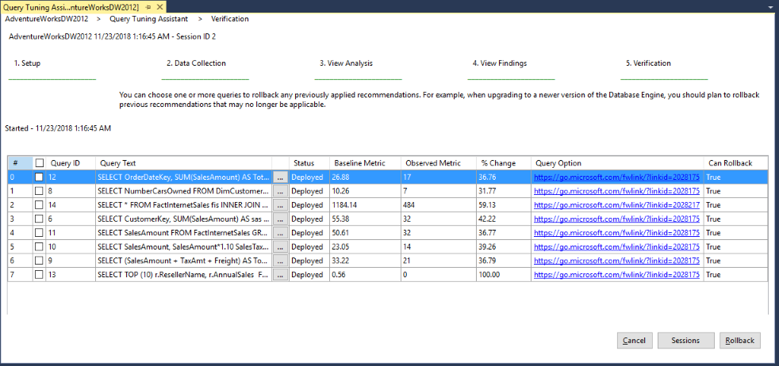
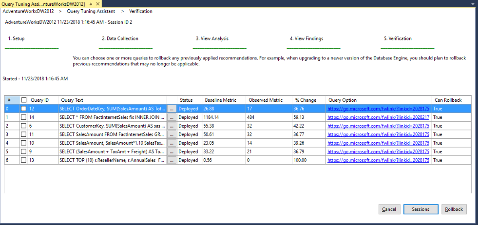

# Upgrading Databases by using the Query Tuning Assistant
[!INCLUDE[appliesto-ss-xxxx-xxxx-xxx-md](../../includes/appliesto-ss-xxxx-xxxx-xxx-md.md)]

When migrating from an older version of [!INCLUDE[ssNoVersion](../../includes/ssnoversion-md.md)] to [!INCLUDE[ssSQL14](../../includes/sssql14-md.md)] or newer, and [upgrading the database compatibility level](../../relational-databases/databases/view-or-change-the-compatibility-level-of-a-database.md) to the latest available, a workload may be exposed to the risk of performance regression. This is also possible to a lesser degree when upgrading between [!INCLUDE[ssSQL14](../../includes/sssql14-md.md)] and any newer version.

Starting with [!INCLUDE[ssSQL14](../../includes/sssql14-md.md)], and with every new version, all query optimizer changes are gated to the latest database compatibility level, so execution plans are not changed right at point of upgrade but rather when a user changes the `COMPATIBILITY_LEVEL` database option to the latest available. For more information on query optimizer changes introduced in [!INCLUDE[ssSQL14](../../includes/sssql14-md.md)], see [Cardinality Estimator](../../relational-databases/performance/cardinality-estimation-sql-server.md). For more information about compatibility levels and how they can affect upgrades, see [Compatibility Levels and SQL Server Upgrades](../../t-sql/statements/alter-database-transact-sql-compatibility-level.md#compatibility-levels-and-sql-server-upgrades).

This gating capability provided by the database compatibility level, in combination with Query Store gives you a great level of control over the query performance in the upgrade process if the upgrade follows the recommended workflow seen below. For more information on the recommended workflow for upgrading the compatibility level, see [Change the Database Compatibility Mode and Use the Query Store](../../database-engine/install-windows/change-the-database-compatibility-mode-and-use-the-query-store.md). 

 

This control over upgrades was further improved with [!INCLUDE[ssSQL17](../../includes/sssql17-md.md)] where [Automatic Tuning](../../relational-databases/automatic-tuning/automatic-tuning.md) was introduced and allows automating the last step in the recommended workflow above.

Starting with [!INCLUDE[ssManStudioFull](../../includes/ssmanstudiofull-md.md)] v18, the new **Query Tuning Assistant (QTA)** feature will guide users through the recommended workflow to keep performance stability during upgrades to newer [!INCLUDE[ssNoVersion](../../includes/ssnoversion-md.md)] versions, as documented in section of [Query Store Usage Scenarios](../../relational-databases/performance/query-store-usage-scenarios.md#CEUpgrade). 

> [!IMPORTANT]
> QTA does not generate user workload. If running QTA in an environment that is not used by your aplications, ensure that you can still execute representative test workload on the targeted [!INCLUDE[ssDEnoversion](../../includes/ssdenoversion-md.md)] by other means. 

## The Query Tuning Assistant workflow
The starting point of QTA assumes that a database from a previous version of [!INCLUDE[ssNoVersion](../../includes/ssnoversion-md.md)] is moved (through [CREATE DATABASE ... FOR ATTACH](../..//relational-databases/databases/attach-a-database.md) or [RESTORE](../../t-sql/statements/restore-statements-transact-sql.md)) to a newer version of the [!INCLUDE[ssDEnoversion](../../includes/ssdenoversion-md.md)], and the before-upgrade database compatibility level is not changed immediately. QTA will guide through the following steps:
1.  Configure Query Store according to recommended settings for the workload duration (in days) set by the user. Think about the workload duration that matches your typical business cycle.
2.  Request to start the required workload, so that Query Store can collect a baseline of workload data (if none available yet).
3.  Upgrade to the target database compatibility level chosen by the user.
4.  Request that a 2nd pass of workload data is collected for comparison and regression detection.
5.  Iterate through any regressions found based on [Query Store **Regressed Queries**](../../relational-databases/performance/monitoring-performance-by-using-the-query-store.md#Regressed) view, experiment by collecting runtime statistics on possible permutations of applicable optimizer model variations, and measure the outcome. 
6.  Report on the measured improvements, and optionally allow those changes to be persisted using [plan guides](../../relational-databases/performance/plan-guides.md).

For more information on attaching a database, see [Database Detach and Attach](../../relational-databases/databases/database-detach-and-attach-sql-server.md#AttachDb).

See below how QTA essentially only changes the last steps of the recommended workflow for upgrading the compatibility level using Query Store seen above. Instead of having the option to choose between the currently inneficient execution plan and the last known good execution plan, QTA presents tuning options that are specific for the selected regressed queries, to create a new improved state with tuned execution plans.

### QTA Tuning internal search space
QTA targets only `SELECT` queries that can be executed from Query Store. Parameterized queries are eligible if the compiled parameter is known. Queries that depend on runtime constructs  such as temporary tables or table variables are not eligible at this time. 

QTA targets known possible patterns of query regressions due to changes in [Cardinality Estimator (CE)](../../relational-databases/performance/cardinality-estimation-sql-server.md) versions. For example, when upgrading a database from [!INCLUDE[ssSQL11](../../includes/sssql11-md.md)] and database compatibility level 110, to [!INCLUDE[ssSQL17](../../includes/sssql17-md.md)] and database compatibility level 140, some queries may regress because they were designed specifically to work with the CE version that existed in [!INCLUDE[ssSQL11](../../includes/sssql11-md.md)] (CE 70). This does not mean that reverting from CE 140 to CE 70 is the only option. If only a specific change in the newer version is introducing the regression, then it is possible to hint that query to use just the relevant part of the previous CE version that was working better for the specific query, while still leveraging all other improvements of newer CE versions. And also allow other queries in the workload that have not regressed to benefit from newer CE improvements.

The CE patterns searched by QTA are the following: 
-  **Independence vs. Correlation**: If independence assumption provides better estimations for the specific query, then the query hint `USE HINT ('ASSUME_MIN_SELECTIVITY_FOR_FILTER_ESTIMATES')` causes [!INCLUDE[ssNoVersion](../../includes/ssnoversion-md.md)] to generate an execution plan by using minimum selectivity when estimating `AND` predicates for filters to account for correlation. For more information, see [USE HINT query hints](../../t-sql/queries/hints-transact-sql-query.md#use_hint) and [Versions of the CE](../../relational-databases/performance/cardinality-estimation-sql-server.md#versions-of-the-ce).
-  **Simple Containment vs. Base Containment**: If a different join containment provides better estimations for the specific query, then the query hint `USE HINT ('ASSUME_JOIN_PREDICATE_DEPENDS_ON_FILTERS')` causes [!INCLUDE[ssNoVersion](../../includes/ssnoversion-md.md)] to generate an execution plan by using the Simple Containment assumption instead of the default Base Containment assumption. For more information, see [USE HINT query hints](../../t-sql/queries/hints-transact-sql-query.md#use_hint) and [Versions of the CE](../../relational-databases/performance/cardinality-estimation-sql-server.md#versions-of-the-ce).
-  **Multi-statement table-valued function (MSTVF) fixed cardinality guess** of 100 rows vs. 1 row: If the default fixed estimation for TVFs of 100 rows does not result in a more efficient plan than using the fixed estimation for TVFs of 1 row (corresponding to the default under the query optimizer CE model of [!INCLUDE[ssKilimanjaro](../../includes/ssKilimanjaro-md.md)] and earlier versions), then the query hint `QUERYTRACEON 9488` is used to generate an execution plan. For more information on MSTVFs, see [Create User-defined Functions &#40;Database Engine&#41;](../../relational-databases/user-defined-functions/create-user-defined-functions-database-engine.md#TVF).

> [!NOTE]
> As a last resort, if the narrow scoped hints are not yielding good enough results for the eligible query patterns, then full use of CE 70 is also considered, by using the query hint `USE HINT ('FORCE_LEGACY_CARDINALITY_ESTIMATION')` to generate an execution plan.

> [!IMPORTANT]
> Any hint forces certain behaviors that may be addressed in future [!INCLUDE[ssNoVersion](../../includes/ssnoversion-md.md)] updates. We recommend you only apply hints when no other option exists, and plan to revisit hinted code with every new upgrade. By forcing behaviors, you may be precluding your workload from benefiting of enhancements introduced in newer versions of [!INCLUDE[ssNoVersion](../../includes/ssnoversion-md.md)].

## Starting Query Tuning Assistant for database upgrades
QTA is a session-based feature that stores session state in the `msqta` schema of the user database where a session is created for the first time. Multiple tuning sessions can be created on a single database over time, but only one active session can exist for any given database.

### Creating a database upgrade session
1.  In [!INCLUDE[ssManStudioFull](../../includes/ssmanstudiofull-md.md)] open the Object Explorer and connect to [!INCLUDE[ssDE](../../includes/ssde-md.md)].

2.  For the database that is intended to upgrade the database compatibility level, right-click the database name, select **Tasks**, select **Database Upgrade**, and click on **New Database Upgrade Session**.

3.  In the QTA Wizard window, two steps are required to configure a session:

    1.  In the **Setup** window, configure Query Store to capture the equivalent of one full business cycle of worload data to analyze and tune. 
        -  Enter the expected workload duration in days (minimum is 1 day). This will be used to propose recommended Query Store settings to tentatively allow the entire baseline to be collected. Capturing a good baseline is important to ensure any regressed queries found after changing the database compatibility level are able to be analyzed. 
        -  Set the intended target database compatibility level that the user database should be at, after the QTA workflow has completed.
        Once complete, click **Next**.
    
         
  
    2.  In the **Settings** window, two columns show the **Current** state of Query Store in the targeted database, as well as the **Recommended** settings. 
        -  The Recommended settings are selected by default, but clicking the radio button over the Current column accepts current settings, and also allows to fine tune the current Query Store configuration. 
        -  The proposed *Stale Query Threshold* setting is twice the number of expected workload duration in days. This is because Query Store will need to hold information on the baseline workload and the post-database upgrade workload.
        Once complete, click **Next**.

       

        > [!IMPORTANT]
        > The proposed *Max Size* is an arbitrary value that may be suited for a short timed workload.   
        > However, keep in mind that it may be insufficient to hold information on the baseline and post-database upgrade workloads for very intensive workloads, namely when many different plans may be generated.   
        > If you antecipate this will be the case, enter a higher value that is appropriate.

4.  The **Tuning** window concludes the session configuration, and instructs on next steps to open and proceed with the session. Once complete, click **Finish**.

    

> [!NOTE]
> A possible alternative scenario starts by restoring a database backup from the production server where a database has already gone through the recommended database compatibility upgrade workflow, to a test server.

### Executing the database upgrade workflow
1.  For the database that is intended to upgrade the database compatibility level, right-click the database name, select **Tasks**, select **Database Upgrade**, and click on **Monitor Sessions**.

2.  The **session management** page lists current and past sessions for the database in scope. Select the desired session, and click on **Details**.

    > [!NOTE]
    > If the current session is not present, click the **Refresh** button.   
    
    The list contains the following information:
    -  **Session ID**
    -  **Session Name**: System generated name comprised of the database name, date and time of session creation.
    -  **Status**: Status of the session (Active or Closed).
    -  **Description**: System generated comprised of the user selected target database compatibility level and number of days for business cycle workload.
    -  **Time Started**: Date and time of when the session was created.

    

    > [!NOTE]
    > **Delete Session** deletes any data stored for the selected session.    
    > However, deleting a closed session does **not** delete any previously deployed plan guides.   
    > If you delete a session that had deployed plan guides, then you cannot use QTA to rollback.    
    > Instead, search for plan guides using the [sys.plan_guides](../../relational-databases/system-catalog-views/sys-plan-guides-transact-sql.md) system table, and delete manually using [sp_control_plan_guide](../../relational-databases/system-stored-procedures/sp-control-plan-guide-transact-sql.md).    
  
3.  The entry point for a new session is the **Data Collection** step. 

    > [!NOTE]
    > The **Sessions** button returns to the **session management** page, leaving the active session as-is.

    This step has 3 substeps:

    1.  **Baseline Data Collection** requests the user to run the representative workload cycle, so that Query Store can collect a baseline. Once that workload has completed, check the **Done with workload run** and click **Next**.

        > [!NOTE]
        > The QTA window can be closed while the workload runs. Returning to the session that remains in active state at a later time will resume from the same step where it was left off. 

        

    2.  **Upgrade Database** will prompt for permission to upgrade the database compatibility level to the desired target. To proceed to the next substep, click **Yes**.

        

        The following page confirms that the database compatibility level was successfully upgraded.

        

    3.  **Observed Data Collection** requests the user to re-run the representative workload cycle, so that Query Store can collect a comparative baseline that will be used to search for optimization opportunities. As the workload executes, use the **Refresh** button to keep updating the list of regressed queries, if any were found. Change the **Queries to show** value to limit the number of queries displayed. The order of the list is affected by the **Metric** (Duration or CpuTime) and the **Aggregation** (Average is default). Also select how many **Queries to show**. Once that workload has completed, check the **Done with workload run** and click **Next**.

        

        The list contains the following information:
        -  **Query ID** 
        -  **Query Text**: [!INCLUDE[tsql](../../includes/tsql-md.md)] statement that can be expanded by clicking the **...** button.
        -  **Runs**: Displays the number of executions of that query for the entore workload collection.
        -  **Baseline Metric**: The selected metric (Duration or CpuTime) in ms for the baseline data collection before the database compatibility upgrade.
        -  **Observed Metric**: The selected metric (Duration or CpuTime) in ms for the data collection after the database compatibility upgrade.
        -  **% Change**: Percentual change for the selected metric between the before and after database compatibility upgrade state. A negative number represents the amount of measured regression for the query.
        -  **Tunable**: *True* or *False* depending on whether the query is eligible for experimentation.

4.  **View Analysis** allows selection of which queries to experiment and find optimization opportunities. The **Queries to show** value becomes the scope of eligible queries to experiment on. Once the desired queries are checked, click **Next** to start experimentation.  

    > [!NOTE]
    > Queries with Tunable = False cannot be selected for experimentation.   
 
    > [!IMPORTANT]
    > A prompt advises that once QTA moves to the experimentation phase, returning to the View Analysis page will not be possible.   
    > If you don't select all eligible queries before moving to the experimentation phase, you need to create a new session at a later time, and repeat the workflow. This requires reset of database compatibility level to the previous value.

    

5.  **View Findings** allows selection of which queries to deploy the proposed optimization as a plan guide. 

    The list contains the following information:
    -  **Query ID** 
    -  **Query Text**: [!INCLUDE[tsql](../../includes/tsql-md.md)] statement that can be expanded by clicking the **...** button.
    -  **Status**: Displays the current experimentation state for the query.
    -  **Baseline Metric**: The selected metric (Duration or CpuTime) in ms for the query as executed in **Step 2 Substep 3**, representing the regressed query after the database compatibility upgrade.
    -  **Observed Metric**: The selected metric (Duration or CpuTime) in ms for the query after experimentation, for a good enough proposed optimization.
    -  **% Change**: Percentual change for the selected metric between the before and after experimentation state, representing the amount of measured improvement for the query with the proposed optimization.
    -  **Query Option**: Link to the proposed hint that improves query execution metric.
    -  **Can Deploy**: *True* or *False* depending on whether the proposed query optimization can be deployed as a plan guide.

    

6.  **Verification** shows the deployment status of previously selected queries for this session. The list in this page differs from the previous page by changing the **Can Deploy** column to **Can Rollback**. This column can be *True* or *False* depending on whether the deployed query optimization can be rolled back and its plan guide removed.

    

    If at a later date there is a need to rollback on a proposed optimization, then select the relevant query and click **Rollback**. That query plan guide is removed and the list updated to remove the rolled back query. Note in the picture below that query 8 was removed.

     

    > [!NOTE]
    > Deleting a closed session does **not** delete any previously deployed plan guides.   
    > If you delete a session that had deployed plan guides, then you cannot use QTA to rollback.    
    > Instead, search for plan guides using the [sys.plan_guides](../../relational-databases/system-catalog-views/sys-plan-guides-transact-sql.md) system table, and delete manually using [sp_control_plan_guide](../../relational-databases/system-stored-procedures/sp-control-plan-guide-transact-sql.md).  
  
## Permissions  
Requires membership of **db_owner** role membership.
  
## See Also  
 [Compatibility Levels and SQL Server Upgrades](../../t-sql/statements/alter-database-transact-sql-compatibility-level.md#compatibility-levels-and-sql-server-upgrades)    
 [Performance Monitoring and Tuning Tools](../../relational-databases/performance/performance-monitoring-and-tuning-tools.md)     
 [Monitoring Performance By Using the Query Store](../../relational-databases/performance/monitoring-performance-by-using-the-query-store.md)     
 [Change the Database Compatibility Mode and Use the Query Store](../../database-engine/install-windows/change-the-database-compatibility-mode-and-use-the-query-store.md)       
 [Trace flags](../../t-sql/database-console-commands/dbcc-traceon-trace-flags-transact-sql.md)    
 [USE HINT query hints](../../t-sql/queries/hints-transact-sql-query.md#use_hint)     
 [Cardinality Estimator](../../relational-databases/performance/cardinality-estimation-sql-server.md)     
 [Automatic Tuning](../../relational-databases/automatic-tuning/automatic-tuning.md)      
