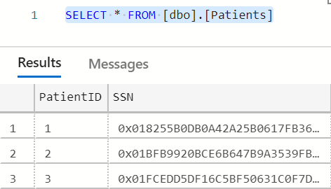
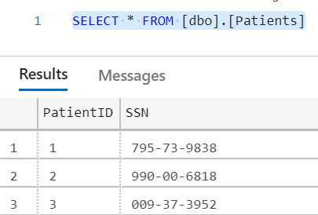
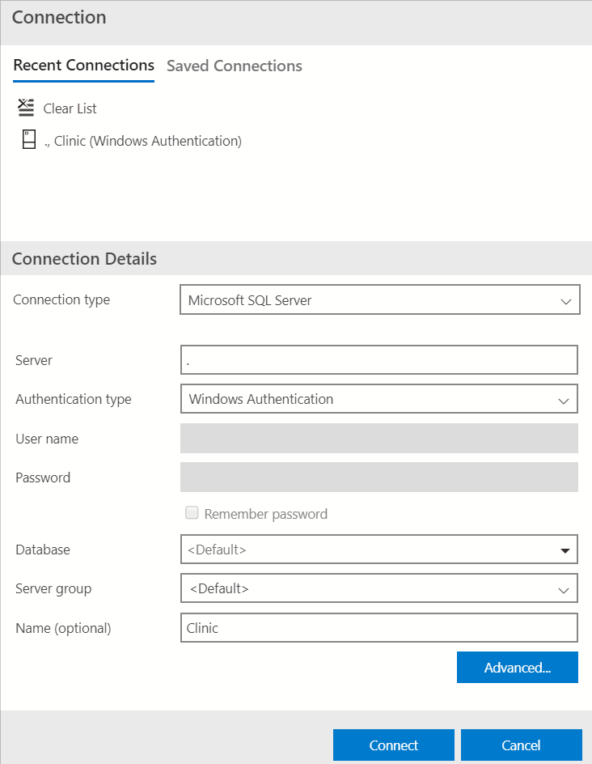
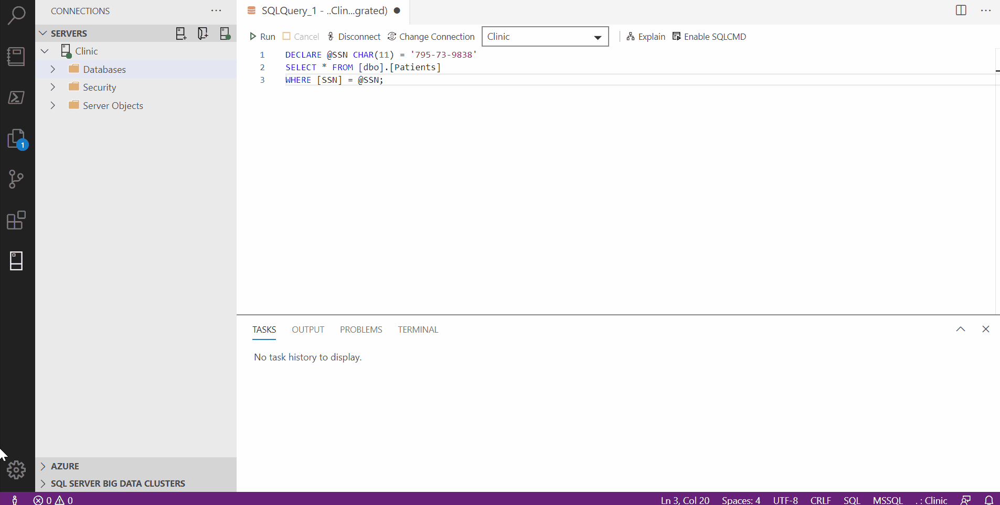

# Query columns using Always Encrypted with Azure Data Studio
[!INCLUDE [SQL Server Azure SQL Database](../../../includes/applies-to-version/sql-asdb.md)]

This article describes how to query columns, encrypted with [Always Encrypted](../../../relational-databases/security/encryption/always-encrypted-database-engine.md) using [Azure Data Studio](../../../azure-data-studio/what-is.md). With Azure Data Studio, you can:
- Retrieve ciphertext values stored in encrypted columns. 
- Retrieve plaintext values stored in encrypted columns.  
- Send plaintext values targeting encrypted columns (for example, in `INSERT` or `UPDATE` statements and as a lookup parameter of the `WHERE` clauses in `SELECT` statements). 

## Retrieving ciphertext values stored in encrypted columns    
This section describes how to retrieve data stored in encrypted columns as ciphertext.

### Steps
1. Make sure you have disabled Always Encrypted for the database connection for the query window, from which you will run a `SELECT` query retrieving ciphertext values. See [Enabling and disabling Always Encrypted for a database connection](#enabling-and-disabling-always-encrypted-for-a-database-connection) below.     
1. Run your `SELECT` query. Any data retrieved from encrypted columns will be returned as binary (encrypted) values.   

### Example
Assuming `SSN` is an encrypted column in the `Patients` table, the query shown below will retrieve binary ciphertext values, if Always Encrypted is disabled for the database connection.   


 
## Retrieving plaintext values stored in encrypted columns    
This section describes how to retrieve data stored in encrypted columns as ciphertext.

### Prerequisites
- Azure Data Studio version 17.1 or later.
- You need to have access to the column master key(s) and the metadata about the key(s) protecting the columns that you are running your query against. For details, see [Permissions for querying encrypted columns](#permissions-for-querying-encrypted-columns) below.
- Your column master key(s) must be stored in Azure Key Vault or Windows Certificate Store. Azure Data Studio does not support other key stores.

### Steps
1.	Enable Always Encrypted for the database connection for the query window, from which you will run a `SELECT` query retrieving and decrypting your data. This will instruct the [Microsoft .NET Data Provider for SQL Server](../../../connect/ado-net/sql/sqlclient-support-always-encrypted.md) (used by Azure Data Studio) to decrypt the encrypted columns in the query result set. See [Enabling and disabling Always Encrypted for a database connection](#enabling-and-disabling-always-encrypted-for-a-database-connection) below.
1.	Run your `SELECT` query. Any data retrieved from encrypted columns will be returned as plaintext values of the original data types.
 
### Example
Assuming SSN is an encrypted column in the `Patients` table, the query shown below will return plaintext values if Always Encrypted is enabled for the database connection, and if you have access to the column master key configured for the `SSN` column.   


 
## Sending plaintext values targeting encrypted columns       
This section describes how to run a query that sends values that target an encrypted column. For example, a query that inserts, updates, or filters by a value stored in an encrypted column:

### Prerequisites
- Azure Data Studio version 18.1 or later.
- You need to have access to the column master key(s) and the metadata about the key(s) protecting the columns you are running your query against. For details, see [Permissions for querying encrypted columns](#permissions-for-querying-encrypted-columns) below.
- Your column master key(s) must be stored in Azure Key Vault or Windows Certificate Store. Azure Data Studio does not support other key stores.

### Steps
1. Enable Always Encrypted for the database connection for the query window, from which you will run a `SELECT` query retrieving and decrypting your data. This will instruct the [Microsoft .NET Data Provider for SQL Server](../../../connect/ado-net/sql/sqlclient-support-always-encrypted.md) (used by Azure Data Studio) to encrypt query parameters targeting encrypted columns and decrypt the results retrieved from encrypted columns. See [Enabling and disabling Always Encrypted for a database connection](#enabling-and-disabling-always-encrypted-for-a-database-connection) below. 
1. Enable Parameterization for Always Encrypted for the query window. See [Parameterization for Always Encrypted](#parameterization-for-always-encrypted) below for details.
1. Declare a Transact-SQL variable and initialize it with a value that you want to send (insert, update, or filter by) to the database. 
1. Run your query sending the value of the Transact-SQL variable to the database. Azure Data Studio will convert the variable to a query parameter and it will encrypt its value before sending it to the database.   

### Example
Assuming `SSN` is an encrypted `char(11)` column in the `Patients` table, the below script will attempt to find a row containing `'795-73-9838'` in the SSN column. The results are returned if Always Encrypted is enabled for the database connection, Parameterization for Always Encrypted is enabled for the query window, and you have access to the column master key configured for the `SSN` column.   


## Permissions for querying encrypted columns

To run any queries against encrypted columns, including queries that retrieve data in ciphertext,  you need the **VIEW ANY COLUMN MASTER KEY DEFINITION** and **VIEW ANY COLUMN ENCRYPTION KEY DEFINITION** permissions in the database.

In addition to the above permissions, to decrypt any query results or to encrypt any query parameters (produced by parameterizing Transact-SQL variables), you also need access to the column master key protecting the target columns:

- **Certificate Store - Local computer:** You must have **Read** access to the certificate that is used as a column master key, or be the administrator on the computer.   
- **Azure Key Vault:** You need the **get**, **unwrapKey**, and **verify** permissions on the key vault containing the column master key.

For more information, see [Create and Store Column Master Keys (Always Encrypted)](../../../relational-databases/security/encryption/create-and-store-column-master-keys-always-encrypted.md).

## Enabling and disabling Always Encrypted for a database connection   
When you connect to a database in Azure Data Studio, you can either enable or disable Always Encrypted for the database connection. By default, Always Encrypted is disabled. 

Enabling Always Encrypted for a database connection instructs the [Microsoft .NET Data Provider for SQL Server](../../../connect/ado-net/sql/sqlclient-support-always-encrypted.md), used by Azure Data Studio, to attempt to transparently:   
-	Decrypt any values retrieved from encrypted columns and returned in query results.   
-	Encrypt the values of the parameterized Transact-SQL variables that target encrypted database columns.   

If you don't enable Always Encrypted for a connection, the Microsoft .NET Data Provider for SQL Server won't try to encrypt query parameters or decrypt results.

You can enable or disable Always Encrypted when you connect to a database. For general information on how to connect to a database see:
- [Quickstart: Connect and query SQL Server using Azure Data Studio](../../../azure-data-studio/quickstart-sql-server.md)
- [Quickstart: Use Azure Data Studio to connect and query Azure SQL database](../../../azure-data-studio/quickstart-sql-database.md)

To enable (disable) Always Encrypted:
1. In the **Connection** dialog, click **Advanced...**.
2. To enable Always Encrypted for the connection, set the **Always Encrypted** field to **Enabled**. To disable Always Encrypted, either leave the value of the **Always Encrypted** field blank or set it to **Disabled**.
3. If you're using [!INCLUDE [sssqlv15-md](../../../includes/sssqlv15-md.md)] and your SQL Server instance is configured with a secure enclave, you can specify an enclave protocol and enclave attestation url. If your SQL Server instance doesn't use a secure enclave, make sure you leave the **Attestation Protocol** and **Enclave Attestation URL** fields blank. For more information, see [Always Encrypted with secure enclaves](always-encrypted-enclaves.md).
4. Click **OK** to close **Advanced Properties**.



> [!TIP]
> To toggle between Always Encrypted being enabled and disabled for an existing query window, click **Disconnect** and then click **Connnect** and complete the above steps to reconnect to your database with the desired values of the **Always Encrypted** field. 

> [!NOTE] 
> The **Change Connection** button in a query window does not currently support toggling between Always Encrypted being enabled and disabled.

## Parameterization for Always Encrypted

Parameterization for Always Encrypted is a feature in Azure Data Studio 18.1 and later that automatically converts Transact-SQL variables into query parameters (instances of [SqlParameter Class](/dotnet/api/microsoft.data.sqlclient.sqlparameter)). This allows the underlying [Microsoft .NET Data Provider for SQL Server](../../../connect/ado-net/sql/sqlclient-support-always-encrypted.md) to detect data targeting encrypted columns, and to encrypt such data before sending it to the database.
  
Without parameterization, the Microsoft .NET Data Provider for SQL Server passes each statement you author in the query window as a non-parameterized query. If the query contains literals or Transact-SQL variables that target encrypted columns, the .NET Framework Data Provider for SQL Server won't be able to detect and encrypt them before sending the query to the database. As a result, the query will fail due to type mismatch (between the plaintext literal Transact-SQL variable and the encrypted column). For example, the following query will fail without parameterization, assuming the `SSN` column is encrypted.   

```sql
DECLARE @SSN CHAR(11) = '795-73-9838'
SELECT * FROM [dbo].[Patients]
WHERE [SSN] = @SSN
```

### Enabling and disabling Parameterization for Always Encrypted

Parameterization for Always Encrypted is disabled by default.

To enable/disable Parameterization for Always Encrypted:

1. Select **File** > **Preferences** > **Settings** (**Code** > **Preferences** > **Settings** on Mac).
2. Navigate to **Data** > **Microsoft SQL Server**.
3. Select or unselect **Enable Parameterization for Always Encrypted**.
4. Close the **Settings** window.



> [!NOTE]
> Parameterization for Always Encrypted works only in a query that use database connections with Always Encrypted enabled (see [Enabling and disabling Always Encrypted for a database connection](#enabling-and-disabling-always-encrypted-for-a-database-connection)). No Transact-SQL variables will be parameterized if the query window uses a database connection without Always Encrypted enabled.

### How Parameterization for Always Encrypted works

If both Parameterization for Always Encrypted and Always Encrypted are enabled for a query window, Azure Data Studio will attempt parameterize Transact-SQL variables that meet the following pre-requisite conditions:

- Are declared and initialized in the same statement (inline initialization). Variables declared using separate `SET` statements won't be parameterized.
- Are initialized using a single literal. Variables initialized using expressions including any operators or functions won't be parameterized.

Below are examples of variables Azure Data Studio will parameterize.

```sql
DECLARE @SSN char(11) = '795-73-9838';
   
DECLARE @BirthDate date = '19990104';
DECLARE @Salary money = $30000;
```

Here are a few examples of variables Azure Data Studio won't attempt to parameterize:

```sql
DECLARE @Name nvarchar(50); --Initialization separate from declaration
SET @Name = 'Abel';

DECLARE @StartDate date = GETDATE(); -- a function used instead of a literal

DECLARE @NewSalary money = @Salary * 1.1; -- an expression used instead of a literal
```
 
For an attempted parameterization to succeed:   
- The type of the literal used for the initialization of the variable to be parametrized must match the type in the variable declaration.   
- If the declared type of the variable is a date type or a time type, the variable must be initialized using a string using one of the following ISO 8601-compliant formats.   

Here are examples of Transact-SQL variable declarations that will result in parameterization errors:

```sql
DECLARE @BirthDate date = '01/04/1999' -- unsupported date format   
   
DECLARE @Number int = 1.1 -- the type of the literal does not match the type of the variable   
```

Azure Data Studio uses Intellisense to inform you which variables can be successfully parameterized and which parameterization attempts fail (and why).   

A declaration of a variable that can be successfully parameterized is marked with an info message underline in the query window. If you hover on a declaration statement that got marked with an info message underline, you'll see the message containing the results of the parameterization process, including the values of the key properties of the resulting [SqlParameter Class](/dotnet/api/microsoft.data.sqlclient.sqlparameter) object (the variable is mapped to: [SqlDbType](/dotnet/api/microsoft.data.sqlclient.sqlparameter.dbtype), [Size](/dotnet/api/microsoft.data.sqlclient.sqlparameter.size), [Precision](/dotnet/api/microsoft.data.sqlclient.sqlparameter.precision), [Scale](/dotnet/api/microsoft.data.sqlclient.sqlparameter.scale), [SqlValue](/dotnet/api/microsoft.data.sqlclient.sqlparameter.sqlvalue)). You can also see the complete list of all variables that have been successfully parameterized in the **Problems** view. To open the **Problems** view, select **View** > **Problems**.    


If Azure Data Studio has attempted to parameterize a variable, but the parameterization has failed, the declaration of the variable will be marked with an error underline. If you hover on the declaration statement that has been marked with an error underline, you'll get the results about the error. You can also see the complete list of parameterization errors for all variables in the **Problems** view.

 
> [!NOTE]
> As Always Encrypted supports a limited subset of type conversions, in many cases it is required that the data type of a Transact-SQL variable is the same as the type of the target database column it targets. For example, assuming the type of the `SSN` column in the `Patients` table is `char(11)`, the below query will fail, as the type of the `@SSN` variable, which is `nchar(11)`, does not match the type of the column.   

```sql
DECLARE @SSN nchar(11) = '795-73-9838'
SELECT * FROM [dbo].[Patients]
WHERE [SSN] = @SSN;
```

```output
Msg 402, Level 16, State 2, Line 5   
The data types char(11) encrypted with (encryption_type = 'DETERMINISTIC', 
encryption_algorithm_name = 'AEAD_AES_256_CBC_HMAC_SHA_256', column_encryption_key_name = 'CEK_Auto1', 
column_encryption_key_database_name = 'Clinic') collation_name = 'Latin1_General_BIN2' 
and nchar(11) encrypted with (encryption_type = 'DETERMINISTIC', 
encryption_algorithm_name = 'AEAD_AES_256_CBC_HMAC_SHA_256', column_encryption_key_name = 'CEK_Auto1', 
column_encryption_key_database_name = 'Clinic') are incompatible in the equal to operator.
```

> [!NOTE]
> Without parameterization, the entire query, including type conversions is processed inside SQL Server/Azure SQL Database. With parameterization enabled, some type conversions are performed by Microsoft .NET Data Provider for SQL Server inside Azure Data Studio. Due to differences between the Microsoft .NET type system and the SQL Server type system (for example, different precision of some types, such as float), a query executed with parameterization enabled can produce different results than the query executed without parameterization enabled. 

## Next Steps
- [Develop applications using Always Encrypted](always-encrypted-client-development.md)


## See Also
- [Always Encrypted](../../../relational-databases/security/encryption/always-encrypted-database-engine.md)