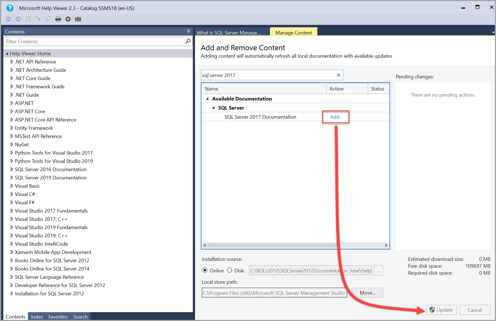
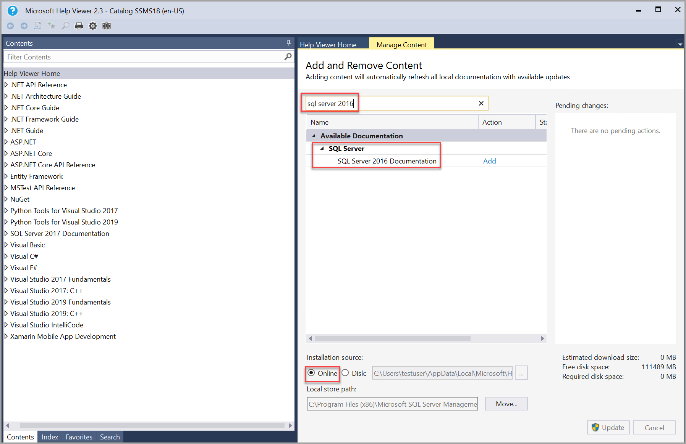
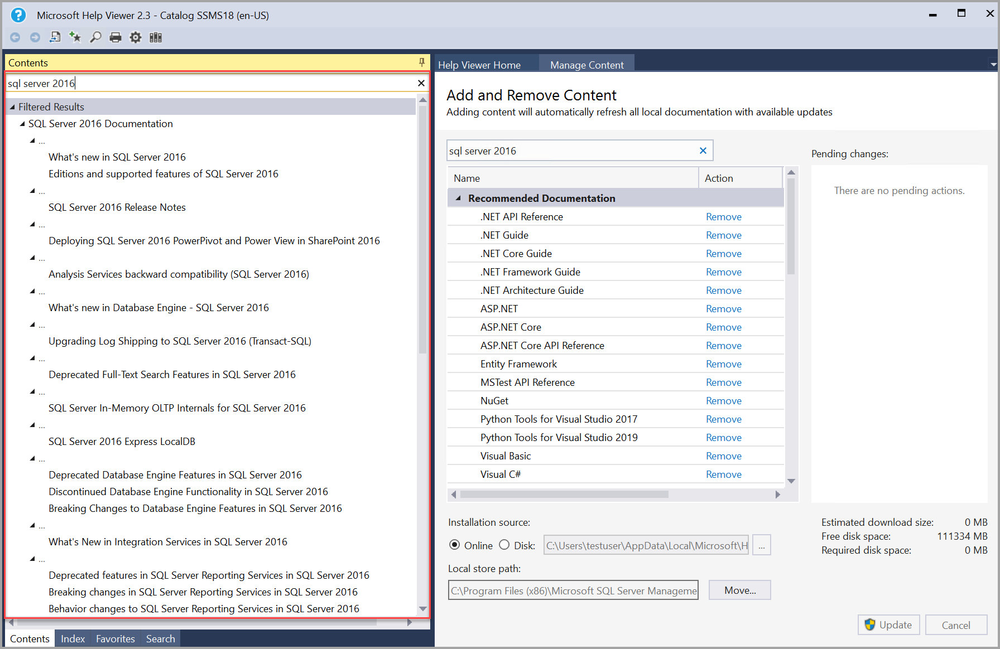
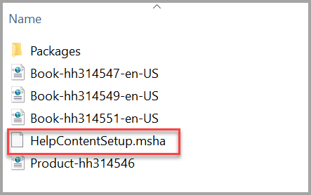
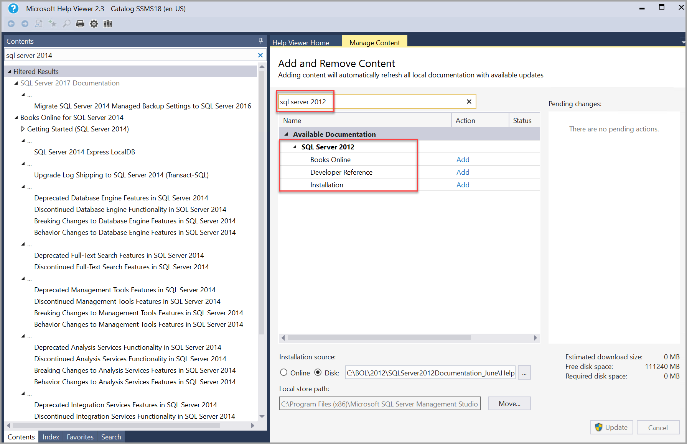
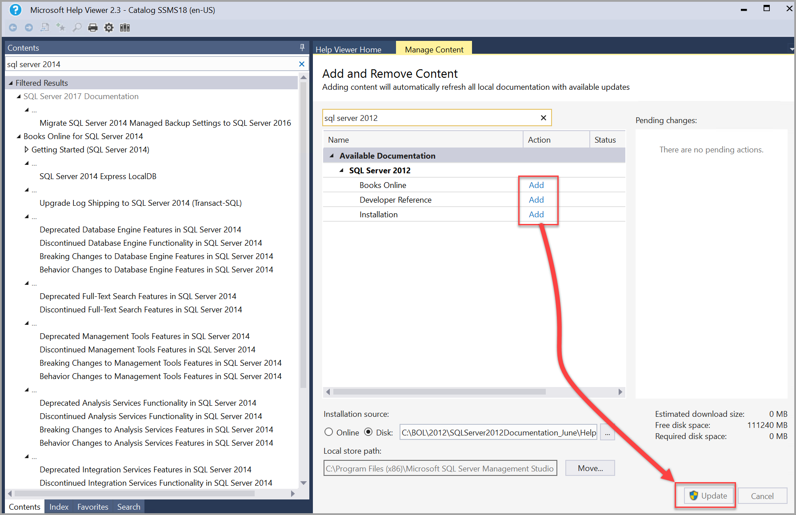
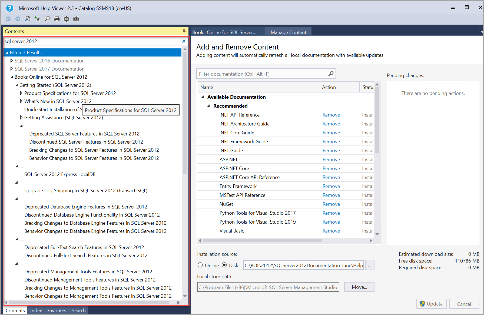

# Install previous versions of SQL Server documentation to view offline in SSMS

[!INCLUDE[appliesto-ss-xxxx-xxxx-xxx-md](../includes/appliesto-ss-xxxx-xxxx-xxx-md.md)]

This article describes how to download and view offline SQL Server content in [SQL Server Management Studio (SSMS)](../ssms/download-sql-server-management-studio-ssms.md). Offline content enables you to access the documentation without an internet connection (although an internet connection is initially required to download it).

Offline documentation is available for several previous versions of SQL Server. Although you can also [view content for previous versions online](https://docs.microsoft.com/previous-versions/sql/), an offline option provides a convenient way to access the older content.

## How to download and configure offline content

You can use download and install SQL Server help packages from online sources or local disk. The following sections explain how to load offline content for different versions of SQL Server:

- [SQL Server 2019](#sql2019)
- [SQL Server 2017](#sql2017)
- [SQL Server 2016](#sql2016)
- [SQL Server 2014](#sql2014)
- [SQL Server 2012](#sql2012)

##  SQL Server 2019

Use the following steps to load the offline documentation for SQL Server 2019.

1. In SSMS, select **Add and Remove Help Content** on the Help menu.

   

   The Help Viewer opens to the Manage Content tab.

2. To find the latest help content for SQL Server 2019, under the **Manage Content** tab choose **Online** under the Installation source and then type in *sql server 2019* in the search bar.

   

   > [!Note]
   > The Local store path on the Manage Content tab shows where on the local computer the content is installed. To change the location, select **Move**, enter a different folder path in the **To** field, and then select **OK**. If the help installation fails after changing the Local store path, close and reopen Help Viewer. Ensure the new location appears in the Local store path and then try the installation again.

3. To install the latest help content for SQL Server 2019, select **Add** next to each content package (book) that you want to install and then select **Update** in the lower right.

   

   > [!NOTE]
   > If the Help Viewer freezes (hangs) while adding content, change the Cache LastRefreshed="\<mm/dd/yyyy> 00:00:00" line in the %LOCALAPPDATA%\Microsoft\HelpViewer2.x\HlpViewer_SSMSx_en-US.settings or HlpViewer_VisualStudiox_en-US.settings file to some date in the future. For more information about this issue, see [Visual Studio Help Viewer freezes](/visualstudio/welcome-to-visual-studio).

4. You can verify that the SQL Server 2019 content is loaded by searching under the content pane on the left for *sql server 2019*.

   

##  SQL Server 2017

Use the following steps to load the offline documentation for SQL Server 2017.

1. In SSMS, select **Add and Remove Help Content** on the Help menu.

   

   The Help Viewer opens to the Manage Content tab.

2. To find the latest help content for SQL Server 2017, under the **Manage Content** tab choose **Online** under the Installation source and then type in *sql server 2017* in the search bar.

   

   > [!Note]
   > The Local store path on the Manage Content tab shows where on the local computer the content is installed. To change the location, select **Move**, enter a different folder path in the **To** field, and then select **OK**. If the help installation fails after changing the Local store path, close and reopen Help Viewer. Ensure the new location appears in the Local store path and then try the installation again.

3. To install the latest help content for SQL Server 2017, select **Add** next to each content package (book) that you want to install and then select **Update** in the lower right.

   

   > [!NOTE]
   > If the Help Viewer freezes (hangs) while adding content, change the Cache LastRefreshed="\<mm/dd/yyyy> 00:00:00" line in the %LOCALAPPDATA%\Microsoft\HelpViewer2.x\HlpViewer_SSMSx_en-US.settings or HlpViewer_VisualStudiox_en-US.settings file to some date in the future. For more information about this issue, see [Visual Studio Help Viewer freezes](/visualstudio/welcome-to-visual-studio).

4. You can verify that the SQL Server 2017 content is loaded by searching under the content pane on the left for *sql server 2017*.

   

##  SQL Server 2016

Use the following steps to load the offline documentation for SQL Server 2016.

1. In SSMS, select **Add and Remove Help Content** on the Help menu.

   

   The Help Viewer opens to the Manage Content tab.

2. To find the latest help content for SQL Server 2016, under the **Manage Content** tab choose **Online** under the Installation source and then type in *sql server 2016* in the search bar.

   

   > [!Note]
   > The Local store path on the Manage Content tab shows where on the local computer the content is installed. To change the location, select **Move**, enter a different folder path in the **To** field, and then select **OK**. If the help installation fails after changing the Local store path, close and reopen Help Viewer. Ensure the new location appears in the Local store path and then try the installation again.

3. To install the latest help content for SQL Server 2016, select **Add** next to each content package (book) that you want to install and then select **Update** in the lower right.

   

   > [!NOTE]
   > If the Help Viewer freezes (hangs) while adding content, change the Cache LastRefreshed="\<mm/dd/yyyy> 00:00:00" line in the %LOCALAPPDATA%\Microsoft\HelpViewer2.x\HlpViewer_SSMSx_en-US.settings or HlpViewer_VisualStudiox_en-US.settings file to some date in the future. For more information about this issue, see [Visual Studio Help Viewer freezes](/visualstudio/welcome-to-visual-studio).

4. You can verify that the SQL Server 2016 content is loaded by searching under the content pane on the left for *sql server 2016*.

   

##  SQL Server 2014

Use the following steps to load the offline documentation for SQL Server 2014.

1. Download the [Product Documentation for Microsoft SQL Server 2014 for firewall and proxy restricted environments](https://www.microsoft.com/download/details.aspx?id=42557) content from the download center and save it to a folder.

2. Unzip the file to view the.msha file.

   

3. In SSMS, select **Add and Remove Help Content** on the Help menu.

   

   The Help Viewer opens to the Manage Content tab.

4. To install the latest help content, choose **Disk** under Installation source and then the ellipses (...).

   

   > [!NOTE]
   > The Local store path on the Manage Content tab shows where on the local computer the content is located. To change the location, select **Move**, enter a different folder path in the **To** field, and then select **OK**.
   If the help installation fails after changing the Local store path, close and reopen the Help Viewer. Ensure the new location appears in the Local store path and then try the installation again.

5. Locate the folder where you unzipped the content. Select the **HelpContentSetup.msha** file in the folder then select **Open**.

   

6. Type in *sql server 2014* in the search bar. Once you see the 2014 content available, select **Add** next to each content package (book) that you want to install to Help Viewer and then select **Update**.

   

   

    > [!NOTE]
    > If the Help Viewer freezes (hangs) while adding content, change the Cache LastRefreshed="\<mm/dd/yyyy> 00:00:00" line in the %LOCALAPPDATA%\Microsoft\HelpViewer2.x\HlpViewer_SSMSx_en-US.settings or HlpViewer_VisualStudiox_en-US.settings file to some date in the future. For more information about this issue, see [Visual Studio Help Viewer freezes](/visualstudio/welcome-to-visual-studio).

7. You can verify that the SQL Server 2014 content installed by searching under the content pane on the left for *sql server 2014*.

   

##  SQL Server 2012

Use the following steps to load the offline documentation for SQL Server 2012.

1. Download the [Product Documentation for Microsoft SQL Server 2012 for firewall and proxy restricted environments](https://www.microsoft.com/download/details.aspx?id=35750) content from the download center and save it to a folder.

2. Unzip the file to view the.msha file.

   

3. In SSMS, select **Add and Remove Help Content** on the Help menu.

   

   The Help Viewer opens to the Manage Content tab.

4. To install the latest help content, choose **Disk** under Installation source and then the ellipses (...).

   

   > [!NOTE]
   > The Local store path on the Manage Content tab shows where on the local computer the content is located. To change the location, select **Move**, enter a different folder path in the **To** field, and then select **OK**.
   If the help installation fails after changing the Local store path, close and reopen the Help Viewer. Ensure the new location appears in the Local store path and then try the installation again.

5. Locate the folder where you unzipped the content. Select the **HelpContentSetup.msha** file in the folder then select **Open**.

   

6. Type in *sql server 2012* in the search bar. Once you see the 2012 content available, select **Add** next to each content package (book) that you want to install to Help Viewer and then select **Update**.

   

   

    > [!NOTE]
    > If the Help Viewer freezes (hangs) while adding content, change the Cache LastRefreshed="\<mm/dd/yyyy> 00:00:00" line in the %LOCALAPPDATA%\Microsoft\HelpViewer2.x\HlpViewer_SSMSx_en-US.settings or HlpViewer_VisualStudiox_en-US.settings file to some date in the future. For more information about this issue, see [Visual Studio Help Viewer freezes](/visualstudio/welcome-to-visual-studio).

7. You can verify that the SQL Server 2012 content is loaded by searching under the content pane on the left for *sql server 2012*.

   

## View offline documentation

You can view SQL Server help content using the **HELP** menu in the latest version of [SQL Server Management Studio (SSMS)](../ssms/download-sql-server-management-studio-ssms.md).

### View offline help content in SSMS

To view the installed help in SSMS, select **Launch in Help Viewer** from the Help menu, to launch the Help Viewer.

     

Help Viewer opens to the Manage Content tab, with the installed help table of contents in the left pane. select articles in the table of contents to display them in the right pane.

> [!TIP]
> If the contents pane is not visible, select Contents on the left margin. select the pushpin icon to keep the contents pane open.  

   

## Life-cycle policy

Review the Microsoft Product Lifecycle for information about how a specific product, service, or technology is supported:

- [Microsoft Lifecycle Policy](https://support.microsoft.com/lifecycle/selectindex)

[!INCLUDE[get-help-options](../includes/paragraph-content/get-help-options.md)]

## Next steps

To learn more about archived content and about Help viewer, please reference the links below.

- [A direct link to previous versions of SQL Server documentation](https://docs.microsoft.com/previous-versions/sql/)
- [Microsoft Help Viewer - Visual Studio](https://docs.microsoft.com/visualstudio/help-viewer/overview)
- [SQL Server Documentation, start](../sql-server/index.yml?view=sql-server-2016)
- [Versioning system for SQL documentation](../sql-server/versioning-system-monikers-ui-sql-server.md?view=sql-server-2016)